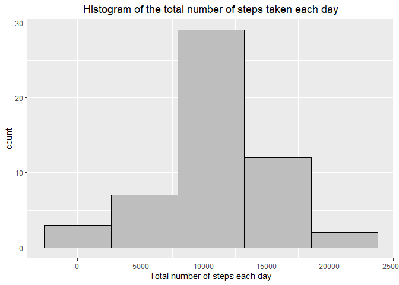
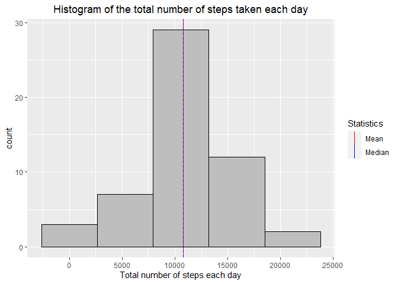
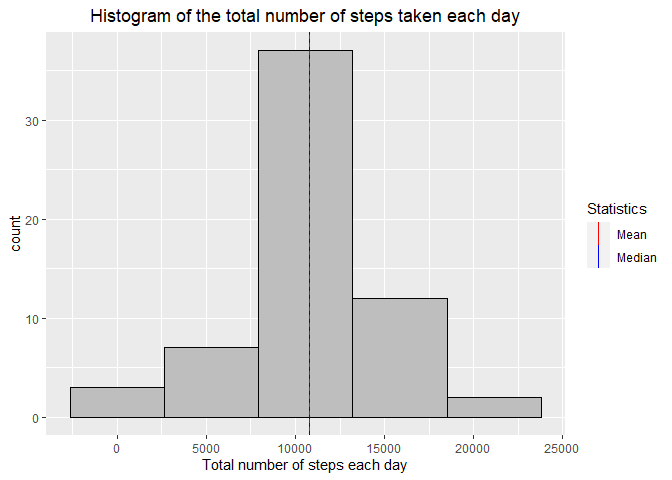
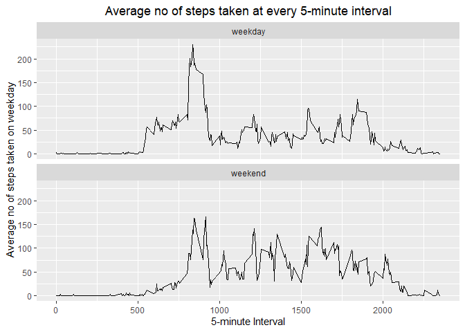

## Introduction
This assignment makes use of data from a personal activity monitoring device. This device collects data at 5 minute 
intervals through out the day. The data consists of two months of data from an anonymous individual collected during 
the months of October and November, 2012 and include the number of steps taken in 5 minute intervals each day.

## Data
The data for this assignment can be downloaded from the course web site:
Dataset: Activity monitoring data [52K] (https://d396qusza40orc.cloudfront.net/repdata%2Fdata%2Factivity.zip)

The variables included in this dataset are:
steps: Number of steps taking in a 5-minute interval (missing values are coded as NA)
date: The date on which the measurement was taken in YYYY-MM-DD format
interval: Identifier for the 5-minute interval in which measurement was taken

The dataset is stored in a comma-separated-value (CSV) file and there are a total of 17,568 observations in this dataset.

## Loading and preprocessing the data


Load library

```r
library(ggplot2)
```

```
## Warning: package 'ggplot2' was built under R version 4.0.5
```

Define some global variables

```r
cURLActivity <- "https://d396qusza40orc.cloudfront.net/repdata%2Fdata%2Factivity.zip"
cZipActivity <- "activity.zip"
cFileActivity <- "activity.csv"
```

Download the data file from the given URL

```r
if (!file.exists(cZipActivity)){
  download.file(cURLActivity, cZipActivity, method="curl")
}  
```

Unzip the data file if the zip file exists but the uncompressed file does not exist

```r
if (file.exists(cZipActivity) & !file.exists(cFileActivity)) { 
  unzip(cZipActivity)
}
```

Read the activity data into dataframe

```r
if (!file.exists(cFileActivity)) {
  print("Required data file is not ready. Please check the zip data file.")
  return
} else {
  dfActivity <- read.csv(cFileActivity, colClasses=c("integer","Date","character"))
}
```


## What is mean total number of steps taken per day?
* Ignore the missing values in the dataset.
* Make a histogram of the total number of steps taken each day

```r
dfTotalStepsEachDay <- aggregate(steps ~ date, dfActivity, sum)
g <- ggplot(dfTotalStepsEachDay, aes(steps))
p <- g + geom_histogram(bins=5, color="black", fill="grey")
p <- p + ggtitle("Histogram of the total number of steps taken each day")+xlab("Total number of steps each day")
p <- p + theme(plot.title = element_text(hjust = 0.5))
print(p)
```

<!-- -->

* Calculate and report the mean, median and total number of steps taken per day

```r
nMeanStepsEachDay <- mean(dfTotalStepsEachDay$steps)
nMedianStepsEachDay <- median(dfTotalStepsEachDay$steps)
nSumStepsEachDay <- sum(dfTotalStepsEachDay$steps)
```
The mean of total number of steps taken per day is 10766.19.

The median of total number of steps taken per day is 10765.

The mean and the median are so close as shown in the histogram below:

```r
p <- p + geom_vline(aes(xintercept=nMeanStepsEachDay, color="Mean"), linewidth=1.5)
```

```
## Warning: Ignoring unknown parameters: linewidth
```

```r
p <- p + geom_vline(aes(xintercept=nMedianStepsEachDay, color="Median"), linetype="dashed", linewidth=1.5)
```

```
## Warning: Ignoring unknown parameters: linewidth
```

```r
p <- p + scale_color_manual(name = "Statistics", values = c(Mean="red", Median="blue"))
print(p)
```

<!-- -->

## What is the average daily activity pattern?
* Make a time series plot of the 5-minute interval and the average number of steps taken, averaged across all days 

```r
dfStepsInterval <- aggregate(steps~interval, dfActivity, FUN=mean)
dfStepsInterval <- transform(dfStepsInterval, interval=as.numeric(interval))
g <- ggplot(dfStepsInterval, aes(interval, steps))
p <- g+geom_line()
p <- p + ggtitle("Average Daily Activity Pattern")+xlab("5-minute Interval")+ylab("Average Number of Steps Taken")
p <- p + theme(plot.title = element_text(hjust = 0.5))
print(p)
```

<!-- -->

* Find out which 5-minute interval, on average across all the days in the dataset, that contains the maximum number of steps

```r
nIntervalWithMaxNoOfSteps <- dfStepsInterval$interval[which.max(dfStepsInterval$steps)]
```
The 5-minute interval that contains the maximum number of steps is 835.


## Imputing missing values
* Calculate and report the total number of missing values in the dataset (i.e. the total number of rows with NAs)

```r
nTotalMissingValues <- nrow(dfActivity[is.na(dfActivity$steps),])
```
The total number of missing values in the dataset is 2304.

* Use mean for filling in all of the missing values in the dataset.
* Create a new dataset that is equal to the original dataset but with the missing data filled in.

```r
dfImputedActivity <- transform(merge(dfActivity, dfStepsInterval, by="interval", all.x=TRUE, no.dups=TRUE), steps.x=ifelse(is.na(steps.x), steps.y, steps.x))
```

* Make a histogram of the total number of steps taken each day and calculate and report the mean and median total number of steps taken per day. 

```r
dfImputedTotalStepsEachDay <- aggregate(steps.x ~ date, dfImputedActivity, sum)
nImputedMeanStepsEachDay <- mean(dfImputedTotalStepsEachDay$steps.x)
nImputedMedianStepsEachDay <- median(dfImputedTotalStepsEachDay$steps.x)
nImputedSumStepsEachDay <- sum(dfImputedTotalStepsEachDay$steps.x)
nChangeSumStepsEachDay <- (nImputedSumStepsEachDay - nSumStepsEachDay) / nSumStepsEachDay * 100
g <- ggplot(dfImputedTotalStepsEachDay, aes(steps.x))
p <- g + geom_histogram(bins=5, color="black", fill="grey")
p <- p + ggtitle("Histogram of the total number of steps taken each day")+xlab("Total number of steps each day")
p <- p + theme(plot.title = element_text(hjust = 0.5))
p <- p + geom_vline(aes(xintercept=nMeanStepsEachDay, color="Mean"), linewidth=1.5)
```

```
## Warning: Ignoring unknown parameters: linewidth
```

```r
p <- p + geom_vline(aes(xintercept=nMedianStepsEachDay, color="Median"), linetype="dashed", linewidth=1.5)
```

```
## Warning: Ignoring unknown parameters: linewidth
```

```r
p <- p + scale_color_manual(name = "Statistics", values = c(Mean="red", Median="blue"))
```

The mean and the median are so close as shown in the histogram below:

```r
print(p)
```

<!-- -->

The mean of total number of steps taken per day is 10766.19.

The median of total number of steps taken per day is 10766.19.

The mean and median are almost equivalent to the estimates from the first part of the assignment after imputing missing data.

However, imputing missing data increase on the estimates of the total daily number of steps by 15.09%.

## Are there differences in activity patterns between weekdays and weekends?
* Create a new factor variable in the dataset with two levels – “weekday” and “weekend” indicating whether a given date is a weekday or weekend day.

```r
dfImputedActivity <- transform(dfImputedActivity, weekday=weekdays(date, abbreviate=TRUE))
dfImputedActivity <- transform(dfImputedActivity, weekdaytype=as.factor(ifelse(weekday %in% c("Sat","Sun"), "weekend", "weekday")))
```

*Make a panel plot containing a time series plot of the 5-minute interval (x-axis) and the average number of steps taken, averaged across all weekday days or weekend days (y-axis).

```r
dfImputedActivityByWeekdayType <- aggregate(steps.x~interval+weekdaytype, dfImputedActivity, mean)
dfImputedActivityByWeekdayType <- transform(dfImputedActivityByWeekdayType, interval=as.numeric(interval))
ggplot(dfImputedActivityByWeekdayType, aes(interval, steps.x, group=1))+facet_wrap(dfImputedActivityByWeekdayType$weekdaytype, ncol=1)+ggtitle("Average no of steps taken at every 5-minute interval")+xlab("5-minute Interval")+ylab("Average no of steps taken on weekday")+theme(plot.title = element_text(hjust = 0.5))+geom_line()
```

<!-- -->

From the plots, we can conclude the activity patterns between weekdays and weekends are clearly difference.
