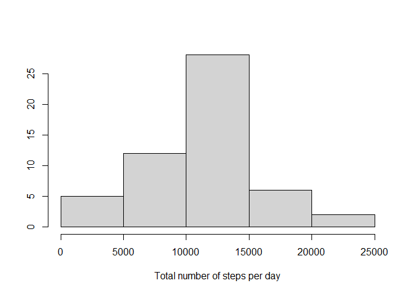
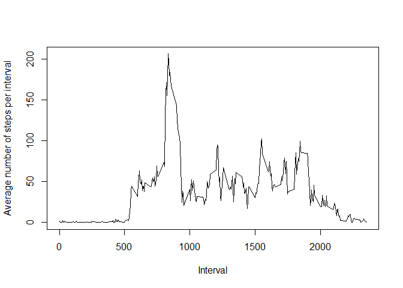
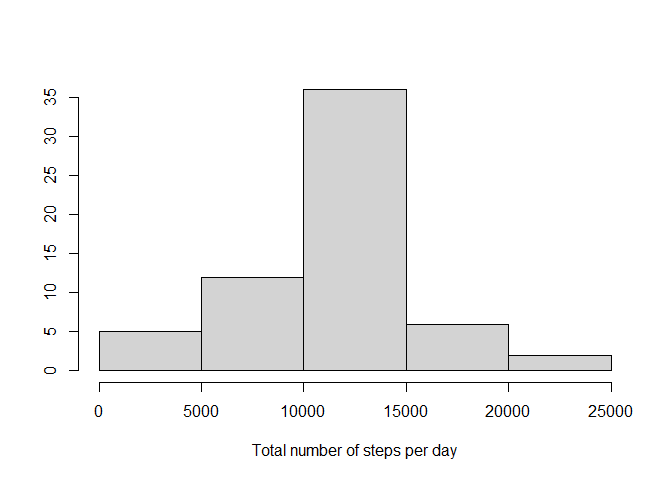
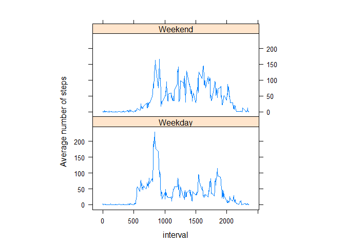

## Loading and preprocessing the data

**1. Load the data (i.e. `read.csv()`)**


```r
df_activity=read.csv("activity.csv")
```

**2. Process/transform the data**

* Load packages:

```r
library(dplyr)
```

```
## Warning: package 'dplyr' was built under R version 4.0.5
```

```r
library(tidyr)
```

```
## Warning: package 'tidyr' was built under R version 4.0.5
```

```r
library(lattice)
```

* Create a new dataframe containing the total number of steps per day:

```r
df_activity$date <- as.Date(df_activity$date)
df_activity_day <- df_activity %>% group_by(date) %>% summarize(total_steps_day = sum(steps))
```

* Create a new dataframe containing the average number of steps time interval across all days:

```r
df_activity_interval<- df_activity %>% group_by(interval) %>% summarize(avg_steps = mean(steps,na.rm=TRUE))
```

## What is mean total number of steps taken per day?

**1. Make a histogram of the total number of steps taken each day**


```r
hist(df_activity_day$total_steps_day, main = " ",xlab= "Total number of steps per day",ylab=" ")
```

<!-- -->

**2. Calculate and report the **mean** and **median** total number of steps taken per day**


```r
mean <- mean(df_activity_day$total_steps_day,na.rm=TRUE)
median <- median(df_activity_day$total_steps_day,na.rm=TRUE)
```

The mean total number of steps taken per day is 10766.19 steps.
The median total number of steps taken per day is 10765 steps.

## What is the average daily activity pattern?

**1. Make a time series plot (i.e. `type = "l"`) of the 5-minute interval (x-axis) and the average number of steps taken, averaged across all days (y-axis)**


```r
plot(df_activity_interval$interval,df_activity_interval$avg_steps,type="l",xlab="Interval",ylab="Average number of steps per interval")
```

<!-- -->

**2. Which 5-minute interval, on average across all the days in the dataset, contains the maximum number of steps?**


```r
interval <- df_activity_interval$interval[which.max(df_activity_interval$avg_steps)]
```

The interval which contains the maximum number of steps on average across all the days is 835th interval.

## Imputing missing values

Note that there are a number of days/intervals where there are missing
values (coded as `NA`). The presence of missing days may introduce
bias into some calculations or summaries of the data.

**1. Calculate and report the total number of missing values in the dataset (i.e. the total number of rows with `NA`s)**


```r
num_na<- sum(!complete.cases(df_activity))
```

The total number of rows with missing values in the dataset is 2304.

**2. Devise a strategy for filling in all of the missing values in the dataset. The strategy does not need to be sophisticated. For example, you could use the mean/median for that day, or the mean for that 5-minute interval, etc.**

Filling of the missing values in the dataset with done by using the mean values for a given 5-minute interval

**3. Create a new dataset that is equal to the original dataset but with the missing data filled in.**


```r
impute.mean <- function(x) replace(x, is.na(x), mean(x, na.rm = TRUE))
df_activity_filled <- df_activity %>% group_by(interval) %>% mutate(steps = impute.mean(steps))
df_activity_filled_day <- df_activity_filled %>% group_by(date) %>% summarize(total_steps_day = sum(steps))
```

**4. Make a histogram of the total number of steps taken each day and Calculate and report the **mean** and **median** total number of steps taken per day. Do these values differ from the estimates from the first part of the assignment? What is the impact of imputing missing data on the estimates of the total daily number of steps?**


```r
hist(df_activity_filled_day$total_steps_day, main = " ",xlab= "Total number of steps per day",ylab=" ")
```

<!-- -->


```r
mean_filled <- mean(df_activity_filled_day$total_steps_day,na.rm=TRUE)
median_filled <- median(df_activity_filled_day$total_steps_day,na.rm=TRUE)
```

The mean total number of steps taken per day is 10766.19 steps and the median total number of steps taken per day is 10766.19 steps, based on the dataset with filled NAs.
Imputing missing data didn't change the mean value, however there is a difference for the median, which got closer to the mean value.

## Are there differences in activity patterns between weekdays and weekends?

For this part the `weekdays()` function may be of some help here. Use
the dataset with the filled-in missing values for this part.

**1. Create a new factor variable in the dataset with two levels -- "weekday" and "weekend" indicating whether a given date is a weekday or weekend day.**


```r
df_activity_filled_wd<-df_activity_filled %>% mutate(weekday = weekdays(as.Date(date))) %>% mutate(weekday = ifelse(weekday %in% c("Saturday", "Sunday"), "Weekend", "Weekday") ) %>% group_by(weekday,interval) %>% summarize(avg_steps = mean(steps,na.rm=TRUE))
```

New dataframe contains a new variable ```weekday```, and is grouped by weekday and interval.

**2. Make a panel plot containing a time series plot (i.e. `type = "l"`) of the 5-minute interval (x-axis) and the average number of steps taken, averaged across all weekday days or weekend days (y-axis).**


```r
xyplot(avg_steps~interval|factor(weekday),data=df_activity_filled_wd,aspect=1/2,type="l",ylab="Average number of steps")
```

<!-- -->
