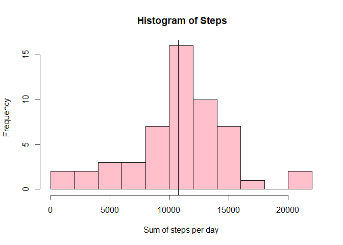
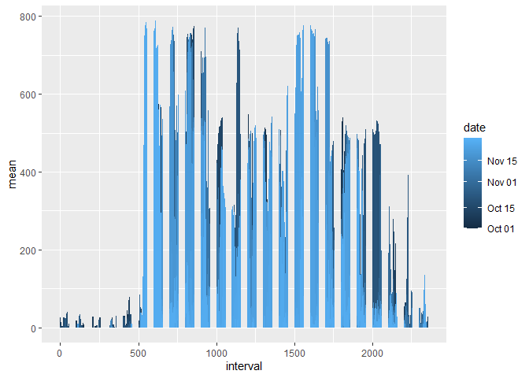
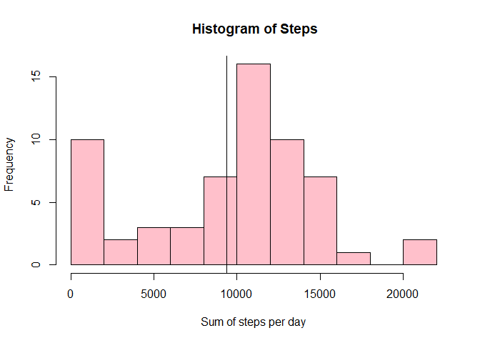
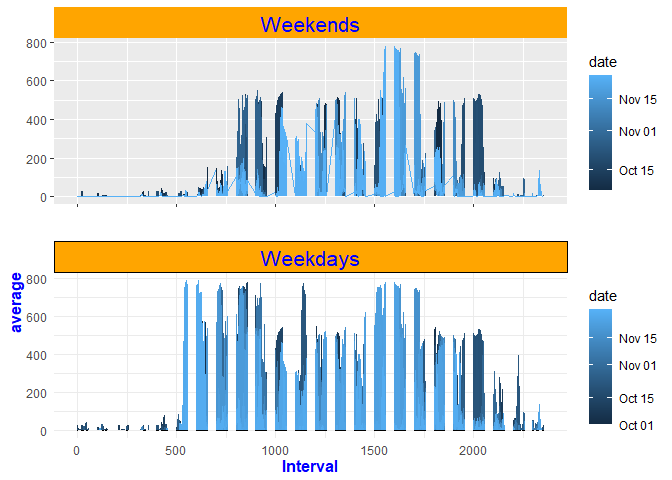

## Loading and preprocessing the data


## Activity Analysis 

We will analyse the data about personal movements activity measured with a monitoring device.
The data has been downloaded here: 
[Activity monitoring data](https://d396qusza40orc.cloudfront.net/repdata%2Fdata%2Factivity.zip) as a csv file.
I will read the cvs file to give a first look


```r
activity <- read.csv("activity.csv")
head(activity)
```

```
##   steps       date interval
## 1    NA 2012-10-01        0
## 2    NA 2012-10-01        5
## 3    NA 2012-10-01       10
## 4    NA 2012-10-01       15
## 5    NA 2012-10-01       20
## 6    NA 2012-10-01       25
```

```r
dim(activity)
```

```
## [1] 17568     3
```

```r
summary(activity)
```

```
##      steps            date              interval     
##  Min.   :  0.00   Length:17568       Min.   :   0.0  
##  1st Qu.:  0.00   Class :character   1st Qu.: 588.8  
##  Median :  0.00   Mode  :character   Median :1177.5  
##  Mean   : 37.38                      Mean   :1177.5  
##  3rd Qu.: 12.00                      3rd Qu.:1766.2  
##  Max.   :806.00                      Max.   :2355.0  
##  NA's   :2304
```
As we can see at first sight there ara 3 variables and 17568 observations of the number of steps taken at an interval of 5 minutes from the 1st of October 2012 to the 30th of November 2012.
The value is stored in the column "steps" and there are 2304 NA values that in total accounts for 192 hours corresponding at 8 days not accounted for.
Let's check the class for each value:


```r
class(activity$steps)
```

```
## [1] "integer"
```

```r
class(activity$date)
```

```
## [1] "character"
```

```r
class(activity$interval)
```

```
## [1] "integer"
```

As we can see the value of the column date is "character" let's transform to "Date"


```r
dt <- as.Date(activity$date)
activity$date <- dt
class(activity$date)
```

```
## [1] "Date"
```

I'd like to keep the column date as it is and make an additional column named "weekdays", doing this I will transform my date language to US.


```r
Sys.setlocale("LC_TIME", "en_US.UTF-8")
```

```
## Warning in Sys.setlocale("LC_TIME", "en_US.UTF-8"): OS reports request to set
## locale to "en_US.UTF-8" cannot be honored
```

```
## [1] ""
```

```r
library(lubridate)
```

```
## Warning: package 'lubridate' was built under R version 4.0.5
```

```r
library(ggplot2)
```

```
## Warning: package 'ggplot2' was built under R version 4.0.5
```


```r
activity$weekdays <- weekdays(activity$date)
```

## What is mean total number of steps taken per day?
now let's calculate the sum of steps each day and store in a variable "daily_steps"
the mean of each day step in a variable "mean_steps"
and the median for each day in a variable "med_steps"


```r
daily_steps <- tapply(activity$steps, activity$date, sum)
summary(daily_steps)
```

```
##    Min. 1st Qu.  Median    Mean 3rd Qu.    Max.    NA's 
##      41    8841   10765   10766   13294   21194       8
```

```r
mean_steps <- daily_steps / 288
m_max <- tapply(activity$steps, activity$date, max)
m_min <- tapply(activity$steps, activity$date, min)
summary(mean_steps)
```

```
##    Min. 1st Qu.  Median    Mean 3rd Qu.    Max.    NA's 
##  0.1424 30.6979 37.3785 37.3826 46.1597 73.5903       8
```

```r
med_steps <- (m_max - m_min) / 2
summary(med_steps)
```

```
##    Min. 1st Qu.  Median    Mean 3rd Qu.    Max.    NA's 
##    16.5   261.5   277.5   300.4   378.5   403.0       8
```
The result is an average of **10766** steps on all the period with a minimum of **41** and a maximum of **21194**, the median is **10765** for the daily sum
The result of the daily mean is **37,4** with a maximum value of **73.6** and a minimum value of **0.14**
The daily median has an overall mean of **300,4** a maximum value of **403** and a minimum of **16.5**
The mean is the average of each day activity.

Let's build a plot to check the trend of the data


```r
hist(daily_steps, col = "pink", xlab = "Sum of steps per day",  main = " Histogram of Steps", breaks = 15)
abline(v =mean(daily_steps, na.rm = TRUE))
```

<!-- -->
As we can see the bigger frequency is from 10000 to 15000 steps per day
Let's create a function that return the sum of step each day this is not required by the assignement but I found it useful


```r
sum_of_daily_steps <- function(daynumber){
      if(daynumber <= length(daily_steps)) {
            sum_of_steps <- daily_steps[[daynumber]]
      }
      else {message("the number exceed 61 days of the data collection ")}
  sum_of_steps
}
```

Now if we want to know the sum of steps, every single day from day 1 to day 61 we just call the function sum_of_daily_steps with argument a number spanning from 1 to 61.
if for example I want to know the sum of steps on second of November 2012 I call the function:


```r
sum_of_steps <- sum_of_daily_steps(33)
print(paste("the number of steps on the day selected are: ", sum_of_steps))
```

```
## [1] "the number of steps on the day selected are:  10600"
```

## What is the average daily activity pattern?
Let's calculate the 5 minutes interval that contains on average the maximum number of steps.
I need to find the interval of 2 adjacent observations which average is the higher.

I will store all the daily means in a variable called "daily_mean"


```r
l_steps <- activity$steps
max_mn <- 0
daily_mean <- list()
    for ( i in 1: length(l_steps)){
        interval <- c(l_steps[i], l_steps[i+1])
        mn <- mean(interval, na.rm = TRUE)
        daily_mean <- append(daily_mean, mn)
    if(!is.na(mn) & mn > max_mn){  
      max_mn <- mn
      index <- i}
    }
```

I will add a column named "means" to the data frame and build a time series plot of the 5 minutes interval and average numbers of steps taken each day 


```r
activity$mean <- as.numeric(daily_mean)
g <-ggplot(activity, aes(interval, mean))
g + geom_line(aes(colour = date)) 
```

```
## Warning: Removed 2 row(s) containing missing values (geom_path).
```

<!-- -->

```r
print(paste("the 5 minutes interval that contains on average the max number of steps is from interval",
            activity$interval[index], "and", activity$interval[index + 1], "on", strftime(activity$date[index], format = " %d %b %Y"), "and is", max_mn, "average steps"))
```

```
## [1] "the 5 minutes interval that contains on average the max number of steps is from interval 610 and 615 on  27 Nov 2012 and is 788 average steps"
```


## Imputing missing values
We saw in the previous summaries that there are **2304** entries with **NA** values, corresponding to 8 days not accounted for, about 13% of the entries. All entries of the first and last days are NAs and these values aren't spred randomly but it seems that few days wasn't recorded at all. 
Let's check where in the database are the NA values

```r
NA_df <- activity[is.na(activity$steps), ]
date_na <- unique(NA_df$date)
date_na
```

```
## [1] "2012-10-01" "2012-10-08" "2012-11-01" "2012-11-04" "2012-11-09"
## [6] "2012-11-10" "2012-11-14" "2012-11-30"
```
Well as I see there are 2 days in October and 6 days in November, I think I will get the  daily average of steps and assign to the NA values.
From the summary of activities we see that the mean is: 37,38 that divided for 288 entries per days gives about 0.14 per day. I will impute this value for each NA value. Note that this value will give 0 for all observations.


```r
activity$steps[is.na(activity$steps)] <- 0.14
```

Let's make a new histogram with the new values.

First I reassign the variable daily_steps according to the changes in the dataframe and get the mean and the median. 


```r
daily_steps <- tapply(activity$steps, activity$date, sum)
mean_steps <- daily_steps / 288
m_max <- tapply(activity$steps, activity$date, max)
m_min <- tapply(activity$steps, activity$date, min)
med_steps <- (m_max - m_min) / 2
days <- unique(as.Date(activity$date))
```

Let's build the histogram now

```r
hist(daily_steps, col = "pink", xlab = "Sum of steps per day",  main = " Histogram of Steps", breaks = 15)
abline(v =mean(daily_steps, na.rm = TRUE))
```

<!-- -->


As we see the histogram is different from the previous one, now the observations from 0 to about 2000 are significantly increased, and that's because we imputed zeros on the NA values and the mean has decreased.
Let's calculate the mean and the median to check for any difference


```r
summary(activity$steps)
```

```
##    Min. 1st Qu.  Median    Mean 3rd Qu.    Max. 
##    0.00    0.00    0.00   32.50    0.14  806.00
```
The median is the same as before, the mean has decreased and the value on the 3rd quartile is now zero

## Are there differences in activity patterns between weekdays and weekends?

And now let's divide the database into weekend and weekdays and build the 2 plots together to check the differences


```r
library(gridExtra)
```

```
## Warning: package 'gridExtra' was built under R version 4.0.5
```

```r
wkends  <- subset(activity, weekdays == "Saturday" | weekdays == "Sunday")
wkdays  <- subset(activity, weekdays != "Saturday" | weekdays != "Sunday")
wkends$tempvar <- "Weekends"
wkdays$tempvar <- "Weekdays"
g <-ggplot(wkends, aes(interval, mean)) + geom_line(aes(colour = date)) + facet_wrap(. ~ tempvar, scales = "free_y") +   theme(strip.background = element_rect(fill="orange"), strip.text = element_text(size=16, colour="blue"), axis.text.x = element_blank()) + xlab("") + ylab("")
p <-ggplot(wkdays, aes(interval, mean)) + geom_line() + theme_minimal() + 
      theme(axis.title.x = element_blank()) + geom_line(aes(colour = date)) + facet_wrap(. ~ tempvar) +   theme(strip.background = element_rect(fill="orange"), strip.text = element_text(size=16, colour="blue"), axis.title.x = element_text(face= "bold", size = 12, colour = "blue"), axis.title.y = element_text(face= "bold", size = 12, colour = "blue", hjust = 1)) + ylab("average") + xlab("Interval")
library(grid)
grid.newpage()
grid.draw(rbind(ggplotGrob(g), ggplotGrob(p), size = "last"))
```

```
## Warning: Removed 2 row(s) containing missing values (geom_path).
```

```
## Warning: Removed 2 row(s) containing missing values (geom_path).
```

<!-- -->

As we can see during the weekends there is less activity during the morning hours and also during the evening, the test is a moderate one, sleeps more during the weekends and don't go out much in the evenings.

**And with this seems to me that all the questions of the assignement were complied with.
Thanks**
