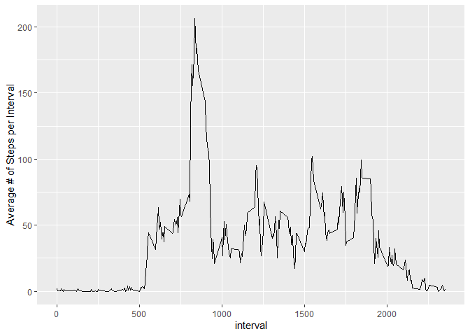
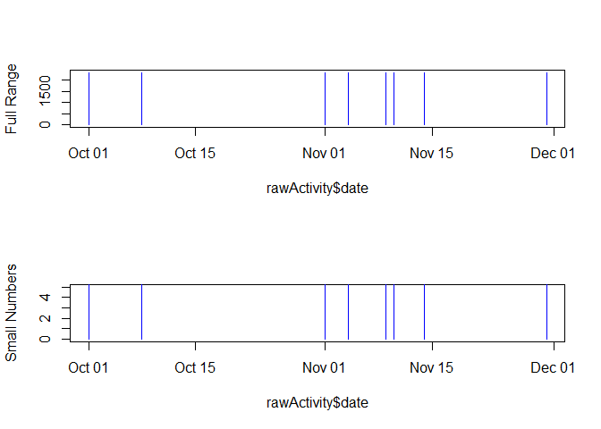
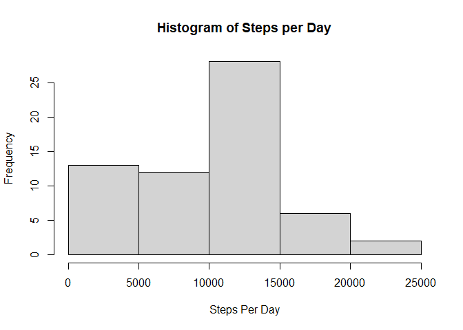
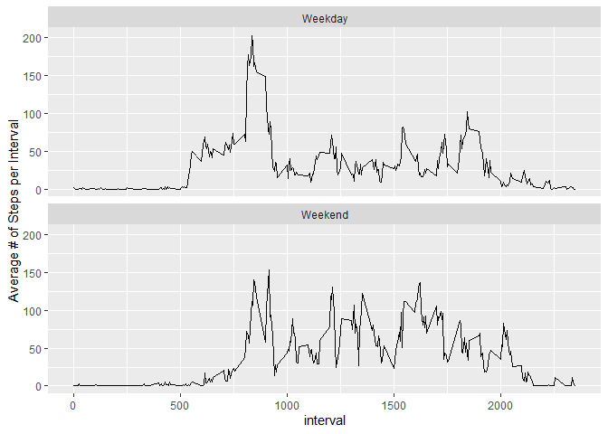

## Loading and preprocessing the data
Raw data can be found at  https://d396qusza40orc.cloudfront.net/repdata%2Fdata%2Factivity.zip  
Note that defaults of read.csv could be used because NA defines missing values and dates are in format "YYYY-MM-DD".  

**rawActivity** is the name of the raw data frame. 
**byDay** is the dataframe with total number of steps


```r
##url <- "https://d396qusza40orc.cloudfront.net/repdata%2Fdata%2Factivity.zip"
##download.file(url, "Factivity.zip", mode = "wb")
##unzip("Factivity.zip")
rawActivity <- read.csv("activity.csv", 
     colClasses = c("integer", "Date", "integer"))
dim(rawActivity)
```

```
[1] 17568     3
```

```r
summary(rawActivity)
```

```
     steps             date               interval     
 Min.   :  0.00   Min.   :2012-10-01   Min.   :   0.0  
 1st Qu.:  0.00   1st Qu.:2012-10-16   1st Qu.: 588.8  
 Median :  0.00   Median :2012-10-31   Median :1177.5  
 Mean   : 37.38   Mean   :2012-10-31   Mean   :1177.5  
 3rd Qu.: 12.00   3rd Qu.:2012-11-15   3rd Qu.:1766.2  
 Max.   :806.00   Max.   :2012-11-30   Max.   :2355.0  
 NA's   :2304                                          
```

```r
library(dplyr)
```

```
Warning: package 'dplyr' was built under R version 4.0.5
```

```

Attaching package: 'dplyr'
```

```
The following objects are masked from 'package:stats':

    filter, lag
```

```
The following objects are masked from 'package:base':

    intersect, setdiff, setequal, union
```

```r
byDay <- rawActivity %>% group_by(date) %>%
     summarize(total = sum(steps, na.rm = TRUE))
```


## What is mean total number of steps taken per day?
Create summary data frame by date and create histogram of all "steps per day" values.  
(Note: filename for plot is *1-hist1* ) 


```r
hist(byDay$total, xlab = "Steps Per Day", main = "Histogram of Steps per Day")
```

<!-- -->
   

Mean steps per day is **9354.2295082** and median steps per day is **10395**. 


## What is the average daily activity pattern?

Time series plot of the average number of steps taken. Create a new dataframe with mean, then plot line graph.   
(Note: filename for plot is *2-Steps_per_interval* ) 


```r
byInterval <- rawActivity %>% group_by(interval) %>%
     summarize(mean = mean(steps, na.rm = TRUE), median = median(steps,na.rm=TRUE) )
library(ggplot2)
```

```
Warning: package 'ggplot2' was built under R version 4.0.5
```

```r
  g <- ggplot(byInterval,  aes(interval,  mean) )
  g + geom_line() + 
       labs(y = "Average # of Steps per Interval" )
```

<!-- -->

```r
  maxMean <- byInterval %>% filter(mean == max(mean))
```

The interval which contains, on average, the maximum number of steps, is #**835**, which has an average of 206.1698113 steps.


## Imputing missing values

By running `summary` on **rawActivity**, we can see that all missing values are in the steps column, and there are 2304 missing values.  


```r
summary(rawActivity)
```

```
     steps             date               interval     
 Min.   :  0.00   Min.   :2012-10-01   Min.   :   0.0  
 1st Qu.:  0.00   1st Qu.:2012-10-16   1st Qu.: 588.8  
 Median :  0.00   Median :2012-10-31   Median :1177.5  
 Mean   : 37.38   Mean   :2012-10-31   Mean   :1177.5  
 3rd Qu.: 12.00   3rd Qu.:2012-11-15   3rd Qu.:1766.2  
 Max.   :806.00   Max.   :2012-11-30   Max.   :2355.0  
 NA's   :2304                                          
```
It is notable that there are 8 days for which all data are NA (indicated by NaN for the mean daily number of steps above).  
To review if there are any additional NA values, All NA data were plotted and the y-axis limits adjusted to see small numbers. In the plots below, one can see that there are exactly 8 days with NA values, so there are no dates where there is a mixture of NA and present data.

(Note: filename for plot is *3-NA_Review* )


```r
par(mfrow=c(2,1))
plot(rawActivity$date, rawActivity$interval, type = "n", ylab = "Full Range")  
with(subset(rawActivity, is.na(steps)), 
     points( date, interval, type = "h",  col = "blue") )
   
plot(rawActivity$date, rawActivity$interval, type = "n", ylim = c(0,5),
     ylab = "Small Numbers")  
with(subset(rawActivity, is.na(steps)), 
     points( date, interval, type = "h",  col = "blue") )
```

<!-- -->

Because of this, one can just set the number of steps to **0** where values are NA. (Or even just remove those rows completely, but that's not what the instructions request.)  
Impute the NA values to zero, creating a new dataframe named **activity**, then re-plot the total number of steps per day to compare to the first plot. 
(Note: filename for plot is *4-hist_after_impute* )


```r
activity <- rawActivity
activity$steps[is.na(activity$steps)] <- 0
par(  mfrow=c(1,1))
byDay2 <- activity %>% group_by(date) %>%
     summarize(total = sum(steps))
hist(byDay2$total, xlab = "Steps Per Day",  main = "Histogram of Steps per Day")
```

<!-- -->

After imputation, mean steps per day is **9354.2295082** and median steps per day is **1.0395\times 10^{4}**.  
As a reminder, from the beginning of the document, before imputation, mean steps per day was **9354.2295082** and median steps per day was **10395**. 


## Are there differences in activity patterns between weekdays and weekends?

To determine if there is a difference between activity patterns on weekdays and weekends, first add a column assigning each date to weekday or weekend as a factor.


```r
activity <- activity %>% mutate(weekend =  as.factor(
          ifelse(weekdays(date) %in% c("Sunday","Saturday") ,"Weekend","Weekday")))
summary(activity)
```

```
     steps             date               interval         weekend     
 Min.   :  0.00   Min.   :2012-10-01   Min.   :   0.0   Weekday:12960  
 1st Qu.:  0.00   1st Qu.:2012-10-16   1st Qu.: 588.8   Weekend: 4608  
 Median :  0.00   Median :2012-10-31   Median :1177.5                  
 Mean   : 32.48   Mean   :2012-10-31   Mean   :1177.5                  
 3rd Qu.:  0.00   3rd Qu.:2012-11-15   3rd Qu.:1766.2                  
 Max.   :806.00   Max.   :2012-11-30   Max.   :2355.0                  
```

Create a plot of average number of steps per 5-minute interval, separated by weekday versus weekend.  
(Note: filename for plot is *5-weekday_vs_end* )


```r
 byInterval <- activity %>% group_by(weekend, interval) %>%
     summarize(mean = mean(steps, na.rm = TRUE), median = median(steps,na.rm=TRUE) )
```

```
`summarise()` has grouped output by 'weekend'. You can override using the `.groups` argument.
```

```r
  g <- ggplot(byInterval,  aes(interval,  mean) )
  g + geom_line() + 
       labs(y = "Average # of Steps per Interval" ) +
       facet_wrap(. ~ weekend, nrow = 2, ncol = 1)
```

<!-- -->

