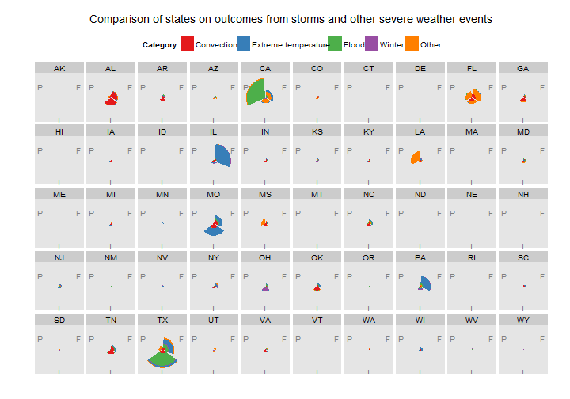

# Comparison of states on outcomes from storms and other severe weather events


## Synopsis

The U.S. National Oceanic and Atmospheric Administration's (NOAA) [storm database](https://d396qusza40orc.cloudfront.net/repdata%2Fdata%2FStormData.csv.bz2)
was used to compare outcomes from storm and severe weather event categories.
Analyzed data are from 1993--2011.
Outcomes analyzed are the number of fatalities and injuries and the dollar
amount of property damage.
Event categories are convective, extreme temperature, flood, winter,
and other.

The state that suffered the greatest number of fatalities was Illinois, with
the most from extreme temperature events (998 fatalities).
The state that suffered the greatest number of injuries was Texas, with the
most from flood events (6,951 injuries).
The state that suffered the greatest property damage was California, with the
most from flood events ($117.4 billion).


## Data Processing

Load packages.
  

```r
packages <- c("data.table", "ggplot2", "xtable")
sapply(packages, require, character.only = TRUE, quietly = TRUE)
```

```
## data.table    ggplot2     xtable 
##       TRUE       TRUE       TRUE
```


Fix URL reading for knitr. See [Stackoverflow](http://stackoverflow.com/a/20003380).


```r
setInternet2(TRUE)
```


### Download and unzip files

Download the storm data documentation files.

* National Weather Service [Storm Data Documentation](https://d396qusza40orc.cloudfront.net/repdata%2Fpeer2_doc%2Fpd01016005curr.pdf)
* National Climatic Data Center Storm Events [FAQ](https://d396qusza40orc.cloudfront.net/repdata%2Fpeer2_doc%2FNCDC%20Storm%20Events-FAQ%20Page.pdf)


```r
url <- "https://d396qusza40orc.cloudfront.net/repdata%2Fpeer2_doc%2Fpd01016005curr.pdf"
f <- file.path(getwd(), "StormDataDocumentation.pdf")
download.file(url, f, mode = "wb")
url <- "https://d396qusza40orc.cloudfront.net/repdata%2Fpeer2_doc%2FNCDC%20Storm%20Events-FAQ%20Page.pdf"
f <- file.path(getwd(), "StormEventsFAQ.pdf")
download.file(url, f, mode = "wb")
```


Download the zipped [storm data file](https://d396qusza40orc.cloudfront.net/repdata%2Fdata%2FStormData.csv.bz2).


```r
url <- "https://d396qusza40orc.cloudfront.net/repdata%2Fdata%2FStormData.csv.bz2"
f <- file.path(getwd(), "StormData.csv.bz2")
download.file(url, f, mode = "wb")
```


Unzip the data file.


```r
executable <- file.path("C:", "Program Files (x86)", "7-Zip", "7z.exe")
parameters <- "x"
switch <- "-aoa"
cmd <- paste(paste0("\"", executable, "\""), parameters, paste0("\"", f, "\""), 
    switch)
cmd
```

```
## [1] "\"C:/Program Files (x86)/7-Zip/7z.exe\" x \"C:/Users/James/Documents/benchan/StormData.csv.bz2\" -aoa"
```

```r
system(cmd)
```


### Read data file

The data file (CSV format) is in the working directory.
Read the CSV file as a data frame.
Then convert to a data table.


```r
f <- file.path(getwd(), "StormData.csv.bz2")
D <- read.csv(f, stringsAsFactors = FALSE)
D <- data.table(D)
str(D)
```

```
## Classes 'data.table' and 'data.frame':	902297 obs. of  37 variables:
##  $ STATE__   : num  1 1 1 1 1 1 1 1 1 1 ...
##  $ BGN_DATE  : chr  "4/18/1950 0:00:00" "4/18/1950 0:00:00" "2/20/1951 0:00:00" "6/8/1951 0:00:00" ...
##  $ BGN_TIME  : chr  "0130" "0145" "1600" "0900" ...
##  $ TIME_ZONE : chr  "CST" "CST" "CST" "CST" ...
##  $ COUNTY    : num  97 3 57 89 43 77 9 123 125 57 ...
##  $ COUNTYNAME: chr  "MOBILE" "BALDWIN" "FAYETTE" "MADISON" ...
##  $ STATE     : chr  "AL" "AL" "AL" "AL" ...
##  $ EVTYPE    : chr  "TORNADO" "TORNADO" "TORNADO" "TORNADO" ...
##  $ BGN_RANGE : num  0 0 0 0 0 0 0 0 0 0 ...
##  $ BGN_AZI   : chr  "" "" "" "" ...
##  $ BGN_LOCATI: chr  "" "" "" "" ...
##  $ END_DATE  : chr  "" "" "" "" ...
##  $ END_TIME  : chr  "" "" "" "" ...
##  $ COUNTY_END: num  0 0 0 0 0 0 0 0 0 0 ...
##  $ COUNTYENDN: logi  NA NA NA NA NA NA ...
##  $ END_RANGE : num  0 0 0 0 0 0 0 0 0 0 ...
##  $ END_AZI   : chr  "" "" "" "" ...
##  $ END_LOCATI: chr  "" "" "" "" ...
##  $ LENGTH    : num  14 2 0.1 0 0 1.5 1.5 0 3.3 2.3 ...
##  $ WIDTH     : num  100 150 123 100 150 177 33 33 100 100 ...
##  $ F         : int  3 2 2 2 2 2 2 1 3 3 ...
##  $ MAG       : num  0 0 0 0 0 0 0 0 0 0 ...
##  $ FATALITIES: num  0 0 0 0 0 0 0 0 1 0 ...
##  $ INJURIES  : num  15 0 2 2 2 6 1 0 14 0 ...
##  $ PROPDMG   : num  25 2.5 25 2.5 2.5 2.5 2.5 2.5 25 25 ...
##  $ PROPDMGEXP: chr  "K" "K" "K" "K" ...
##  $ CROPDMG   : num  0 0 0 0 0 0 0 0 0 0 ...
##  $ CROPDMGEXP: chr  "" "" "" "" ...
##  $ WFO       : chr  "" "" "" "" ...
##  $ STATEOFFIC: chr  "" "" "" "" ...
##  $ ZONENAMES : chr  "" "" "" "" ...
##  $ LATITUDE  : num  3040 3042 3340 3458 3412 ...
##  $ LONGITUDE : num  8812 8755 8742 8626 8642 ...
##  $ LATITUDE_E: num  3051 0 0 0 0 ...
##  $ LONGITUDE_: num  8806 0 0 0 0 ...
##  $ REMARKS   : chr  "" "" "" "" ...
##  $ REFNUM    : num  1 2 3 4 5 6 7 8 9 10 ...
##  - attr(*, ".internal.selfref")=<externalptr>
```


### Clean data

Rename the variables to lowercase for ease of coding.


```r
old <- names(D)
new <- tolower(old)
setnames(D, old, new)
```


Convert the `bgn_date` character class variable to a date class variable.


```r
bgn_date <- strsplit(D$bgn_date, "[^[:digit:]]")
bgn_date <- unlist(bgn_date)
bgn_date <- as.numeric(bgn_date)
bgn_date <- matrix(bgn_date, nrow = nrow(D), byrow = TRUE)
dateStr <- sprintf("%4d%02d%02d", bgn_date[, 3], bgn_date[, 1], bgn_date[, 2])
D <- D[, `:=`(beginDate, as.Date(dateStr, format = "%Y%m%d"))]
rm(bgn_date, dateStr)
```


Scale the property damage variable into a new variable, `propertyDamage`.

* If `propdmgexp` = `B`, then multiply `propdmg` by 1,000,000,000
* Else if `propdmgexp` = `M`, then multiply `propdmg` by 1,000,000
* Else if `propdmgexp` = `K`, then multiply `propdmg` by 1,000
* Else if `propdmgexp` = `H`, then multiply `propdmg` by 100
* Else leave `propdmg` as-is


```r
D <- D[, `:=`(propdmgexp, toupper(propdmgexp))]
D[, .N, propdmgexp]
```

```
##     propdmgexp      N
##  1:          K 424665
##  2:          M  11337
##  3:            465934
##  4:          B     40
##  5:          +      5
##  6:          0    216
##  7:          5     28
##  8:          6      4
##  9:          ?      8
## 10:          4      4
## 11:          2     13
## 12:          3      4
## 13:          H      7
## 14:          7      5
## 15:          -      1
## 16:          1     25
## 17:          8      1
```

```r
D <- D[, `:=`(propertyDamage, ifelse(propdmgexp == "B", propdmg * 1e+09, ifelse(propdmgexp == 
    "M", propdmg * 1e+06, ifelse(propdmgexp == "K", propdmg * 1000, ifelse(propdmgexp == 
    "H", propdmg * 100, propdmg)))))]
summary(D$propertyDamage)
```

```
##     Min.  1st Qu.   Median     Mean  3rd Qu.     Max. 
## 0.00e+00 0.00e+00 0.00e+00 4.74e+05 5.00e+02 1.15e+11
```


Scale the crop damage variable into a new variable, `cropDamage`.

* If `cropdmgexp` = `B`, then multiply `cropdmg` by 1,000,000,000
* Else if `cropdmgexp` = `M`, then multiply `cropdmg` by 1,000,000
* Else if `cropdmgexp` = `K`, then multiply `cropdmg` by 1,000
* Else leave `cropdmg` as-is


```r
D <- D[, `:=`(cropdmgexp, toupper(cropdmgexp))]
D[, .N, cropdmgexp]
```

```
##    cropdmgexp      N
## 1:            618413
## 2:          M   1995
## 3:          K 281853
## 4:          B      9
## 5:          ?      7
## 6:          0     19
## 7:          2      1
```

```r
D <- D[, `:=`(cropDamage, ifelse(cropdmgexp == "B", cropdmg * 1e+09, ifelse(cropdmgexp == 
    "M", cropdmg * 1e+06, ifelse(cropdmgexp == "K", cropdmg * 1000, cropdmg))))]
summary(D$cropDamage)
```

```
##     Min.  1st Qu.   Median     Mean  3rd Qu.     Max. 
## 0.00e+00 0.00e+00 0.00e+00 5.44e+04 0.00e+00 5.00e+09
```


#### Group event types

List the number of unique values of `evtype`.
The number of unique values is too large to manage without some grouping.


```r
message(sprintf("Number of unique values of evtype: %.0d", length(unique(D$evtype))))
```

```
## Number of unique values of evtype: 985
```


Group event types to mimic the categories found in the [2009 Annual Summaries](http://www.ncdc.noaa.gov/oa/climate/sd/annsum2009.pdf) on page 3.

`evtype` needs a lot of data cleaning.
Particularly, values need to be grouped to resolve spelling variations.
Also, records can have multiple events listed in the `evtype` variable.
Create indicator variables for common event types.

Define a helper function `freqtab` to help with grouping `evtype` values.


```r
indicator <- function(regex) {
    indicator <- grepl(regex, D$evtype, ignore.case = TRUE)
    uniqueEventTypes <- unique(D[indicator, evtype])
    show(uniqueEventTypes[order(uniqueEventTypes)])
    indicator
}
```


Create an indicators for variations of **Lightning**, **Tornado**, **Thunderstorm Wind**, and **Hail**.
List the event types that fall into the category of **Convection**.


```r
regexLightning <- "\\bL\\S+?G\\b"
regexTornado <- "(NADO)|(\\bTOR\\S+?O\\b|(\\bFUN))"
regexThunderstorm <- "THUNDERSTORM|TSTM"
regexWind <- "(WIND)|(WND)"
regexHail <- "HAIL"
regex <- paste(regexLightning, regexTornado, regexThunderstorm, regexWind, regexHail, 
    sep = "|")
D <- D[, `:=`(eventConvection, indicator(regex))]
```

```
##   [1] " LIGHTNING"                     " TSTM WIND"                    
##   [3] " TSTM WIND (G45)"               " WIND"                         
##   [5] "BITTER WIND CHILL"              "BITTER WIND CHILL TEMPERATURES"
##   [7] "BLIZZARD AND EXTREME WIND CHIL" "BLIZZARD/HIGH WIND"            
##   [9] "BLOWING SNOW- EXTREME WIND CHI" "BLOWING SNOW & EXTREME WIND CH"
##  [11] "BLOWING SNOW/EXTREME WIND CHIL" "COLD AIR FUNNEL"               
##  [13] "COLD AIR FUNNELS"               "COLD AIR TORNADO"              
##  [15] "COLD WIND CHILL TEMPERATURES"   "COLD/WIND CHILL"               
##  [17] "COLD/WINDS"                     "DEEP HAIL"                     
##  [19] "DOWNBURST WINDS"                "DRY MICROBURST WINDS"          
##  [21] "DRY MIRCOBURST WINDS"           "DUST STORM/HIGH WINDS"         
##  [23] "EXTREME COLD/WIND CHILL"        "EXTREME WIND CHILL"            
##  [25] "EXTREME WIND CHILL/BLOWING SNO" "EXTREME WIND CHILLS"           
##  [27] "EXTREME WINDCHILL"              "EXTREME WINDCHILL TEMPERATURES"
##  [29] "FLASH FLOOD WINDS"              "FLASH FLOODING/THUNDERSTORM WI"
##  [31] "FLOOD/RAIN/WIND"                "FLOOD/RAIN/WINDS"              
##  [33] "Flood/Strong Wind"              "FUNNEL"                        
##  [35] "Funnel Cloud"                   "FUNNEL CLOUD"                  
##  [37] "FUNNEL CLOUD."                  "FUNNEL CLOUD/HAIL"             
##  [39] "FUNNEL CLOUDS"                  "FUNNELS"                       
##  [41] "gradient wind"                  "Gradient wind"                 
##  [43] "GRADIENT WIND"                  "GRADIENT WINDS"                
##  [45] "GUSTNADO"                       "GUSTNADO AND"                  
##  [47] "GUSTY LAKE WIND"                "GUSTY THUNDERSTORM WIND"       
##  [49] "GUSTY THUNDERSTORM WINDS"       "Gusty Wind"                    
##  [51] "GUSTY WIND"                     "GUSTY WIND/HAIL"               
##  [53] "GUSTY WIND/HVY RAIN"            "Gusty wind/rain"               
##  [55] "Gusty winds"                    "Gusty Winds"                   
##  [57] "GUSTY WINDS"                    "HAIL"                          
##  [59] "HAIL 0.75"                      "HAIL 0.88"                     
##  [61] "HAIL 075"                       "HAIL 088"                      
##  [63] "HAIL 1.00"                      "HAIL 1.75"                     
##  [65] "HAIL 1.75)"                     "HAIL 100"                      
##  [67] "HAIL 125"                       "HAIL 150"                      
##  [69] "HAIL 175"                       "HAIL 200"                      
##  [71] "HAIL 225"                       "HAIL 275"                      
##  [73] "HAIL 450"                       "HAIL 75"                       
##  [75] "HAIL 80"                        "HAIL 88"                       
##  [77] "HAIL ALOFT"                     "HAIL DAMAGE"                   
##  [79] "HAIL FLOODING"                  "HAIL STORM"                    
##  [81] "Hail(0.75)"                     "HAIL/ICY ROADS"                
##  [83] "HAIL/WIND"                      "HAIL/WINDS"                    
##  [85] "HAILSTORM"                      "HAILSTORMS"                    
##  [87] "Heavy Rain and Wind"            "HEAVY RAIN/LIGHTNING"          
##  [89] "HEAVY RAIN/WIND"                "HEAVY RAIN; URBAN FLOOD WINDS;"
##  [91] "HEAVY SNOW AND HIGH WINDS"      "HEAVY SNOW AND STRONG WINDS"   
##  [93] "HEAVY SNOW/HIGH WIND"           "HEAVY SNOW/HIGH WINDS"         
##  [95] "HEAVY SNOW/HIGH WINDS & FLOOD"  "HEAVY SNOW/HIGH WINDS/FREEZING"
##  [97] "HEAVY SNOW/WIND"                "Heavy surf and wind"           
##  [99] "HIGH  WINDS"                    "High Wind"                     
## [101] "HIGH WIND"                      "HIGH WIND (G40)"               
## [103] "HIGH WIND 48"                   "HIGH WIND 63"                  
## [105] "HIGH WIND 70"                   "HIGH WIND AND HEAVY SNOW"      
## [107] "HIGH WIND AND HIGH TIDES"       "HIGH WIND AND SEAS"            
## [109] "HIGH WIND DAMAGE"               "HIGH WIND/ BLIZZARD"           
## [111] "HIGH WIND/BLIZZARD"             "HIGH WIND/BLIZZARD/FREEZING RA"
## [113] "HIGH WIND/HEAVY SNOW"           "HIGH WIND/LOW WIND CHILL"      
## [115] "HIGH WIND/SEAS"                 "HIGH WIND/WIND CHILL"          
## [117] "HIGH WIND/WIND CHILL/BLIZZARD"  "HIGH WINDS"                    
## [119] "HIGH WINDS 55"                  "HIGH WINDS 57"                 
## [121] "HIGH WINDS 58"                  "HIGH WINDS 63"                 
## [123] "HIGH WINDS 66"                  "HIGH WINDS 67"                 
## [125] "HIGH WINDS 73"                  "HIGH WINDS 76"                 
## [127] "HIGH WINDS 80"                  "HIGH WINDS 82"                 
## [129] "HIGH WINDS AND WIND CHILL"      "HIGH WINDS DUST STORM"         
## [131] "HIGH WINDS HEAVY RAINS"         "HIGH WINDS/"                   
## [133] "HIGH WINDS/COASTAL FLOOD"       "HIGH WINDS/COLD"               
## [135] "HIGH WINDS/FLOODING"            "HIGH WINDS/HEAVY RAIN"         
## [137] "HIGH WINDS/SNOW"                "HURRICANE OPAL/HIGH WINDS"     
## [139] "ICE/STRONG WINDS"               "LATE SEASON HAIL"              
## [141] "LIGHTING"                       "LIGHTNING"                     
## [143] "LIGHTNING  WAUSEON"             "LIGHTNING AND HEAVY RAIN"      
## [145] "LIGHTNING AND THUNDERSTORM WIN" "LIGHTNING AND WINDS"           
## [147] "LIGHTNING DAMAGE"               "LIGHTNING FIRE"                
## [149] "LIGHTNING INJURY"               "LIGHTNING THUNDERSTORM WINDS"  
## [151] "LIGHTNING THUNDERSTORM WINDSS"  "LIGHTNING."                    
## [153] "LIGHTNING/HEAVY RAIN"           "LIGNTNING"                     
## [155] "LOW WIND CHILL"                 "MARINE HAIL"                   
## [157] "MARINE HIGH WIND"               "MARINE STRONG WIND"            
## [159] "MARINE THUNDERSTORM WIND"       "MARINE TSTM WIND"              
## [161] "MICROBURST WINDS"               "NON-SEVERE WIND DAMAGE"        
## [163] "NON-TSTM WIND"                  "NON SEVERE HAIL"               
## [165] "NON TSTM WIND"                  "RAIN AND WIND"                 
## [167] "RAIN/WIND"                      "RECORD COLD AND HIGH WIND"     
## [169] "SEVERE THUNDERSTORM"            "SEVERE THUNDERSTORM WINDS"     
## [171] "SEVERE THUNDERSTORMS"           "small hail"                    
## [173] "Small Hail"                     "SMALL HAIL"                    
## [175] "SNOW- HIGH WIND- WIND CHILL"    "SNOW AND WIND"                 
## [177] "SNOW/HIGH WINDS"                "STORM FORCE WINDS"             
## [179] "Strong Wind"                    "STRONG WIND"                   
## [181] "STRONG WIND GUST"               "Strong winds"                  
## [183] "Strong Winds"                   "STRONG WINDS"                  
## [185] "THUDERSTORM WINDS"              "THUNDEERSTORM WINDS"           
## [187] "THUNDERESTORM WINDS"            "THUNDERSTORM"                  
## [189] "THUNDERSTORM  WINDS"            "THUNDERSTORM DAMAGE"           
## [191] "THUNDERSTORM DAMAGE TO"         "THUNDERSTORM HAIL"             
## [193] "THUNDERSTORM W INDS"            "Thunderstorm Wind"             
## [195] "THUNDERSTORM WIND"              "THUNDERSTORM WIND (G40)"       
## [197] "THUNDERSTORM WIND 50"           "THUNDERSTORM WIND 52"          
## [199] "THUNDERSTORM WIND 56"           "THUNDERSTORM WIND 59"          
## [201] "THUNDERSTORM WIND 59 MPH"       "THUNDERSTORM WIND 59 MPH."     
## [203] "THUNDERSTORM WIND 60 MPH"       "THUNDERSTORM WIND 65 MPH"      
## [205] "THUNDERSTORM WIND 65MPH"        "THUNDERSTORM WIND 69"          
## [207] "THUNDERSTORM WIND 98 MPH"       "THUNDERSTORM WIND G50"         
## [209] "THUNDERSTORM WIND G51"          "THUNDERSTORM WIND G52"         
## [211] "THUNDERSTORM WIND G55"          "THUNDERSTORM WIND G60"         
## [213] "THUNDERSTORM WIND G61"          "THUNDERSTORM WIND TREES"       
## [215] "THUNDERSTORM WIND."             "THUNDERSTORM WIND/ TREE"       
## [217] "THUNDERSTORM WIND/ TREES"       "THUNDERSTORM WIND/AWNING"      
## [219] "THUNDERSTORM WIND/HAIL"         "THUNDERSTORM WIND/LIGHTNING"   
## [221] "THUNDERSTORM WINDS"             "THUNDERSTORM WINDS      LE CEN"
## [223] "THUNDERSTORM WINDS 13"          "THUNDERSTORM WINDS 2"          
## [225] "THUNDERSTORM WINDS 50"          "THUNDERSTORM WINDS 52"         
## [227] "THUNDERSTORM WINDS 53"          "THUNDERSTORM WINDS 60"         
## [229] "THUNDERSTORM WINDS 61"          "THUNDERSTORM WINDS 62"         
## [231] "THUNDERSTORM WINDS 63 MPH"      "THUNDERSTORM WINDS AND"        
## [233] "THUNDERSTORM WINDS FUNNEL CLOU" "THUNDERSTORM WINDS G"          
## [235] "THUNDERSTORM WINDS G60"         "THUNDERSTORM WINDS HAIL"       
## [237] "THUNDERSTORM WINDS HEAVY RAIN"  "THUNDERSTORM WINDS LIGHTNING"  
## [239] "THUNDERSTORM WINDS SMALL STREA" "THUNDERSTORM WINDS URBAN FLOOD"
## [241] "THUNDERSTORM WINDS."            "THUNDERSTORM WINDS/ FLOOD"     
## [243] "THUNDERSTORM WINDS/ HAIL"       "THUNDERSTORM WINDS/FLASH FLOOD"
## [245] "THUNDERSTORM WINDS/FLOODING"    "THUNDERSTORM WINDS/FUNNEL CLOU"
## [247] "THUNDERSTORM WINDS/HAIL"        "THUNDERSTORM WINDS/HEAVY RAIN" 
## [249] "THUNDERSTORM WINDS53"           "THUNDERSTORM WINDSHAIL"        
## [251] "THUNDERSTORM WINDSS"            "THUNDERSTORM WINS"             
## [253] "THUNDERSTORMS"                  "THUNDERSTORMS WIND"            
## [255] "THUNDERSTORMS WINDS"            "THUNDERSTORMW"                 
## [257] "THUNDERSTORMW 50"               "THUNDERSTORMW WINDS"           
## [259] "THUNDERSTORMWINDS"              "THUNDERSTROM WIND"             
## [261] "THUNDERSTROM WINDS"             "THUNDERTORM WINDS"             
## [263] "THUNDERTSORM WIND"              "THUNDESTORM WINDS"             
## [265] "THUNERSTORM WINDS"              "TORNADO"                       
## [267] "TORNADO DEBRIS"                 "TORNADO F0"                    
## [269] "TORNADO F1"                     "TORNADO F2"                    
## [271] "TORNADO F3"                     "TORNADO/WATERSPOUT"            
## [273] "TORNADOES"                      "TORNADOES, TSTM WIND, HAIL"    
## [275] "TORNADOS"                       "TORNDAO"                       
## [277] "TSTM"                           "TSTM HEAVY RAIN"               
## [279] "Tstm Wind"                      "TSTM WIND"                     
## [281] "TSTM WIND  (G45)"               "TSTM WIND (41)"                
## [283] "TSTM WIND (G35)"                "TSTM WIND (G40)"               
## [285] "TSTM WIND (G45)"                "TSTM WIND 40"                  
## [287] "TSTM WIND 45"                   "TSTM WIND 50"                  
## [289] "TSTM WIND 51"                   "TSTM WIND 52"                  
## [291] "TSTM WIND 55"                   "TSTM WIND 65)"                 
## [293] "TSTM WIND AND LIGHTNING"        "TSTM WIND DAMAGE"              
## [295] "TSTM WIND G45"                  "TSTM WIND G58"                 
## [297] "TSTM WIND/HAIL"                 "TSTM WINDS"                    
## [299] "TSTM WND"                       "TSTMW"                         
## [301] "TUNDERSTORM WIND"               "WAKE LOW WIND"                 
## [303] "WALL CLOUD/FUNNEL CLOUD"        "WATERSPOUT-TORNADO"            
## [305] "WATERSPOUT FUNNEL CLOUD"        "WATERSPOUT TORNADO"            
## [307] "WATERSPOUT/ TORNADO"            "WATERSPOUT/TORNADO"            
## [309] "Whirlwind"                      "WHIRLWIND"                     
## [311] "Wind"                           "WIND"                          
## [313] "WIND ADVISORY"                  "WIND AND WAVE"                 
## [315] "WIND CHILL"                     "WIND CHILL/HIGH WIND"          
## [317] "Wind Damage"                    "WIND DAMAGE"                   
## [319] "WIND GUSTS"                     "WIND STORM"                    
## [321] "WIND/HAIL"                      "WINDS"                         
## [323] "WINTER STORM HIGH WINDS"        "WINTER STORM/HIGH WIND"        
## [325] "WINTER STORM/HIGH WINDS"        "WND"
```


Create an indicators for variations of **Cold** and **Heat**.
List the event types that fall into the category of **Extreme Temperatures**.


```r
regex <- "COLD|HEAT"
D <- D[, `:=`(eventExtremeTemp, indicator(regex))]
```

```
##  [1] "Cold"                         "COLD"                        
##  [3] "COLD AIR FUNNEL"              "COLD AIR FUNNELS"            
##  [5] "COLD AIR TORNADO"             "Cold and Frost"              
##  [7] "COLD AND FROST"               "COLD AND SNOW"               
##  [9] "COLD AND WET CONDITIONS"      "Cold Temperature"            
## [11] "COLD TEMPERATURES"            "COLD WAVE"                   
## [13] "COLD WEATHER"                 "COLD WIND CHILL TEMPERATURES"
## [15] "COLD/WIND CHILL"              "COLD/WINDS"                  
## [17] "DROUGHT/EXCESSIVE HEAT"       "Excessive Cold"              
## [19] "EXCESSIVE HEAT"               "EXCESSIVE HEAT/DROUGHT"      
## [21] "Extended Cold"                "Extreme Cold"                
## [23] "EXTREME COLD"                 "EXTREME COLD/WIND CHILL"     
## [25] "EXTREME HEAT"                 "EXTREME/RECORD COLD"         
## [27] "FOG AND COLD TEMPERATURES"    "HEAT"                        
## [29] "HEAT DROUGHT"                 "Heat Wave"                   
## [31] "HEAT WAVE"                    "HEAT WAVE DROUGHT"           
## [33] "HEAT WAVES"                   "HEAT/DROUGHT"                
## [35] "Heatburst"                    "HIGH WINDS/COLD"             
## [37] "Prolong Cold"                 "PROLONG COLD"                
## [39] "PROLONG COLD/SNOW"            "RECORD  COLD"                
## [41] "Record Cold"                  "RECORD COLD"                 
## [43] "RECORD COLD AND HIGH WIND"    "RECORD COLD/FROST"           
## [45] "Record Heat"                  "RECORD HEAT"                 
## [47] "RECORD HEAT WAVE"             "RECORD SNOW/COLD"            
## [49] "RECORD/EXCESSIVE HEAT"        "SEVERE COLD"                 
## [51] "SNOW AND COLD"                "SNOW/ BITTER COLD"           
## [53] "SNOW/COLD"                    "SNOW\\COLD"                  
## [55] "Unseasonable Cold"            "UNSEASONABLY COLD"           
## [57] "UNUSUALLY COLD"
```


Create an indicators for variations of **Flood** and **Rain**.
List the event types that fall into the category of **Flood**.


```r
regexFlood <- "(\\bFL\\S+?D)"
regexRain <- "RAIN|PRECIP|SHOWER"
regex <- paste(regexFlood, regexRain, sep = "|")
D <- D[, `:=`(eventFlood, indicator(regex))]
```

```
##   [1] " COASTAL FLOOD"                 " FLASH FLOOD"                  
##   [3] "BEACH EROSION/COASTAL FLOOD"    "BEACH FLOOD"                   
##   [5] "BELOW NORMAL PRECIPITATION"     "BLIZZARD/FREEZING RAIN"        
##   [7] "BREAKUP FLOODING"               "COASTAL  FLOODING/EROSION"     
##   [9] "Coastal Flood"                  "COASTAL FLOOD"                 
##  [11] "coastal flooding"               "Coastal Flooding"              
##  [13] "COASTAL FLOODING"               "COASTAL FLOODING/EROSION"      
##  [15] "COASTAL/TIDAL FLOOD"            "CSTL FLOODING/EROSION"         
##  [17] "EARLY RAIN"                     "Erosion/Cstl Flood"            
##  [19] "EXCESSIVE PRECIPITATION"        "EXCESSIVE RAIN"                
##  [21] "EXCESSIVE RAINFALL"             "FLASH FLOOD"                   
##  [23] "FLASH FLOOD - HEAVY RAIN"       "FLASH FLOOD FROM ICE JAMS"     
##  [25] "FLASH FLOOD LANDSLIDES"         "FLASH FLOOD WINDS"             
##  [27] "FLASH FLOOD/"                   "FLASH FLOOD/ FLOOD"            
##  [29] "FLASH FLOOD/ STREET"            "FLASH FLOOD/FLOOD"             
##  [31] "FLASH FLOOD/HEAVY RAIN"         "FLASH FLOOD/LANDSLIDE"         
##  [33] "FLASH FLOODING"                 "FLASH FLOODING/FLOOD"          
##  [35] "FLASH FLOODING/THUNDERSTORM WI" "FLASH FLOODS"                  
##  [37] "FLASH FLOOODING"                "Flood"                         
##  [39] "FLOOD"                          "FLOOD & HEAVY RAIN"            
##  [41] "FLOOD FLASH"                    "FLOOD FLOOD/FLASH"             
##  [43] "FLOOD WATCH/"                   "FLOOD/FLASH"                   
##  [45] "Flood/Flash Flood"              "FLOOD/FLASH FLOOD"             
##  [47] "FLOOD/FLASH FLOODING"           "FLOOD/FLASH/FLOOD"             
##  [49] "FLOOD/FLASHFLOOD"               "FLOOD/RAIN/WIND"               
##  [51] "FLOOD/RAIN/WINDS"               "FLOOD/RIVER FLOOD"             
##  [53] "Flood/Strong Wind"              "FLOODING"                      
##  [55] "FLOODING/HEAVY RAIN"            "FLOODS"                        
##  [57] "Freezing rain"                  "Freezing Rain"                 
##  [59] "FREEZING RAIN"                  "FREEZING RAIN AND SLEET"       
##  [61] "FREEZING RAIN AND SNOW"         "FREEZING RAIN SLEET AND"       
##  [63] "FREEZING RAIN SLEET AND LIGHT"  "FREEZING RAIN/SLEET"           
##  [65] "FREEZING RAIN/SNOW"             "GUSTY WIND/HVY RAIN"           
##  [67] "Gusty wind/rain"                "HAIL FLOODING"                 
##  [69] "HEAVY PRECIPATATION"            "Heavy Precipitation"           
##  [71] "HEAVY PRECIPITATION"            "Heavy rain"                    
##  [73] "Heavy Rain"                     "HEAVY RAIN"                    
##  [75] "HEAVY RAIN AND FLOOD"           "Heavy Rain and Wind"           
##  [77] "HEAVY RAIN EFFECTS"             "HEAVY RAIN/FLOODING"           
##  [79] "Heavy Rain/High Surf"           "HEAVY RAIN/LIGHTNING"          
##  [81] "HEAVY RAIN/MUDSLIDES/FLOOD"     "HEAVY RAIN/SEVERE WEATHER"     
##  [83] "HEAVY RAIN/SMALL STREAM URBAN"  "HEAVY RAIN/SNOW"               
##  [85] "HEAVY RAIN/URBAN FLOOD"         "HEAVY RAIN/WIND"               
##  [87] "HEAVY RAIN; URBAN FLOOD WINDS;" "HEAVY RAINFALL"                
##  [89] "HEAVY RAINS"                    "HEAVY RAINS/FLOODING"          
##  [91] "HEAVY SHOWER"                   "HEAVY SHOWERS"                 
##  [93] "HEAVY SNOW   FREEZING RAIN"     "Heavy snow shower"             
##  [95] "HEAVY SNOW/FREEZING RAIN"       "HEAVY SNOW/HIGH WINDS & FLOOD" 
##  [97] "HEAVY SURF COASTAL FLOODING"    "HIGH WINDS HEAVY RAINS"        
##  [99] "HIGH WINDS/COASTAL FLOOD"       "HIGH WINDS/FLOODING"           
## [101] "HIGH WINDS/HEAVY RAIN"          "HIGHWAY FLOODING"              
## [103] "HVY RAIN"                       "Ice jam flood (minor"          
## [105] "ICE JAM FLOODING"               "ICE STORM/FLASH FLOOD"         
## [107] "LAKE FLOOD"                     "LAKESHORE FLOOD"               
## [109] "LANDSLIDE/URBAN FLOOD"          "LIGHT FREEZING RAIN"           
## [111] "LIGHT SNOW/FREEZING PRECIP"     "LIGHTNING AND HEAVY RAIN"      
## [113] "LIGHTNING/HEAVY RAIN"           "LOCAL FLASH FLOOD"             
## [115] "LOCAL FLOOD"                    "LOCALLY HEAVY RAIN"            
## [117] "MAJOR FLOOD"                    "MINOR FLOOD"                   
## [119] "Minor Flooding"                 "MINOR FLOODING"                
## [121] "MIXED PRECIP"                   "Mixed Precipitation"           
## [123] "MIXED PRECIPITATION"            "MONTHLY PRECIPITATION"         
## [125] "Monthly Rainfall"               "MONTHLY RAINFALL"              
## [127] "MUD SLIDES URBAN FLOODING"      "NORMAL PRECIPITATION"          
## [129] "PROLONGED RAIN"                 "RAIN"                          
## [131] "RAIN (HEAVY)"                   "RAIN AND WIND"                 
## [133] "Rain Damage"                    "RAIN/SNOW"                     
## [135] "RAIN/WIND"                      "RAINSTORM"                     
## [137] "RECORD LOW RAINFALL"            "RECORD PRECIPITATION"          
## [139] "RECORD RAINFALL"                "RECORD/EXCESSIVE RAINFALL"     
## [141] "REMNANTS OF FLOYD"              "RIVER AND STREAM FLOOD"        
## [143] "RIVER FLOOD"                    "River Flooding"                
## [145] "RIVER FLOODING"                 "RURAL FLOOD"                   
## [147] "SLEET & FREEZING RAIN"          "SLEET/FREEZING RAIN"           
## [149] "SLEET/RAIN/SNOW"                "SMALL STREAM AND URBAN FLOOD"  
## [151] "SMALL STREAM AND URBAN FLOODIN" "SMALL STREAM FLOOD"            
## [153] "SMALL STREAM FLOODING"          "SMALL STREAM URBAN FLOOD"      
## [155] "SMALL STREAM/URBAN FLOOD"       "SNOW FREEZING RAIN"            
## [157] "SNOW SHOWERS"                   "SNOW/FREEZING RAIN"            
## [159] "SNOW/RAIN"                      "SNOW/RAIN/SLEET"               
## [161] "SNOW/SLEET/FREEZING RAIN"       "SNOW/SLEET/RAIN"               
## [163] "SNOWMELT FLOODING"              "STREAM FLOODING"               
## [165] "STREET FLOOD"                   "STREET FLOODING"               
## [167] "Thundersnow shower"             "THUNDERSTORM WINDS HEAVY RAIN" 
## [169] "THUNDERSTORM WINDS URBAN FLOOD" "THUNDERSTORM WINDS/ FLOOD"     
## [171] "THUNDERSTORM WINDS/FLASH FLOOD" "THUNDERSTORM WINDS/FLOODING"   
## [173] "THUNDERSTORM WINDS/HEAVY RAIN"  "TIDAL FLOOD"                   
## [175] "Tidal Flooding"                 "TIDAL FLOODING"                
## [177] "TORRENTIAL RAIN"                "Torrential Rainfall"           
## [179] "TSTM HEAVY RAIN"                "UNSEASONAL RAIN"               
## [181] "URBAN AND SMALL STREAM FLOOD"   "URBAN AND SMALL STREAM FLOODIN"
## [183] "Urban flood"                    "Urban Flood"                   
## [185] "URBAN FLOOD"                    "URBAN FLOOD LANDSLIDE"         
## [187] "Urban Flooding"                 "URBAN FLOODING"                
## [189] "URBAN FLOODS"                   "URBAN SMALL STREAM FLOOD"      
## [191] "URBAN/SMALL FLOODING"           "URBAN/SMALL STREAM  FLOOD"     
## [193] "URBAN/SMALL STREAM FLOOD"       "URBAN/SMALL STREAM FLOODING"   
## [195] "URBAN/STREET FLOODING"
```


Create an indicator for variations of **Snow**, **Ice**, **Freeze**, or **Winter Weather**.
List the event types that fall into the category of **Winter**.


```r
regex <- "(SNOW)|(ICE)|(ICY)|(FREEZ)|(WINT)"
D <- D[, `:=`(eventWinter, indicator(regex))]
```

```
##   [1] "ACCUMULATED SNOWFALL"           "AGRICULTURAL FREEZE"           
##   [3] "Black Ice"                      "BLACK ICE"                     
##   [5] "BLIZZARD AND HEAVY SNOW"        "BLIZZARD/FREEZING RAIN"        
##   [7] "BLIZZARD/HEAVY SNOW"            "BLIZZARD/WINTER STORM"         
##   [9] "blowing snow"                   "Blowing Snow"                  
##  [11] "BLOWING SNOW"                   "BLOWING SNOW- EXTREME WIND CHI"
##  [13] "BLOWING SNOW & EXTREME WIND CH" "BLOWING SNOW/EXTREME WIND CHIL"
##  [15] "COLD AND SNOW"                  "Damaging Freeze"               
##  [17] "DAMAGING FREEZE"                "Drifting Snow"                 
##  [19] "EARLY FREEZE"                   "EARLY SNOW"                    
##  [21] "Early snowfall"                 "EARLY SNOWFALL"                
##  [23] "EXCESSIVE SNOW"                 "FALLING SNOW/ICE"              
##  [25] "FIRST SNOW"                     "FLASH FLOOD FROM ICE JAMS"     
##  [27] "Freeze"                         "FREEZE"                        
##  [29] "Freezing drizzle"               "Freezing Drizzle"              
##  [31] "FREEZING DRIZZLE"               "FREEZING DRIZZLE AND FREEZING" 
##  [33] "Freezing Fog"                   "FREEZING FOG"                  
##  [35] "Freezing rain"                  "Freezing Rain"                 
##  [37] "FREEZING RAIN"                  "FREEZING RAIN AND SLEET"       
##  [39] "FREEZING RAIN AND SNOW"         "FREEZING RAIN SLEET AND"       
##  [41] "FREEZING RAIN SLEET AND LIGHT"  "FREEZING RAIN/SLEET"           
##  [43] "FREEZING RAIN/SNOW"             "Freezing Spray"                
##  [45] "Frost/Freeze"                   "FROST/FREEZE"                  
##  [47] "FROST\\FREEZE"                  "GLAZE ICE"                     
##  [49] "GLAZE/ICE STORM"                "HAIL/ICY ROADS"                
##  [51] "HARD FREEZE"                    "HEAVY LAKE SNOW"               
##  [53] "HEAVY RAIN/SNOW"                "HEAVY SNOW"                    
##  [55] "HEAVY SNOW-SQUALLS"             "HEAVY SNOW   FREEZING RAIN"    
##  [57] "HEAVY SNOW & ICE"               "HEAVY SNOW AND"                
##  [59] "HEAVY SNOW AND HIGH WINDS"      "HEAVY SNOW AND ICE"            
##  [61] "HEAVY SNOW AND ICE STORM"       "HEAVY SNOW AND STRONG WINDS"   
##  [63] "HEAVY SNOW ANDBLOWING SNOW"     "Heavy snow shower"             
##  [65] "HEAVY SNOW SQUALLS"             "HEAVY SNOW/BLIZZARD"           
##  [67] "HEAVY SNOW/BLIZZARD/AVALANCHE"  "HEAVY SNOW/BLOWING SNOW"       
##  [69] "HEAVY SNOW/FREEZING RAIN"       "HEAVY SNOW/HIGH"               
##  [71] "HEAVY SNOW/HIGH WIND"           "HEAVY SNOW/HIGH WINDS"         
##  [73] "HEAVY SNOW/HIGH WINDS & FLOOD"  "HEAVY SNOW/HIGH WINDS/FREEZING"
##  [75] "HEAVY SNOW/ICE"                 "HEAVY SNOW/ICE STORM"          
##  [77] "HEAVY SNOW/SLEET"               "HEAVY SNOW/SQUALLS"            
##  [79] "HEAVY SNOW/WIND"                "HEAVY SNOW/WINTER STORM"       
##  [81] "HEAVY SNOWPACK"                 "HEAVY WET SNOW"                
##  [83] "HIGH WIND AND HEAVY SNOW"       "HIGH WIND/BLIZZARD/FREEZING RA"
##  [85] "HIGH WIND/HEAVY SNOW"           "HIGH WINDS/SNOW"               
##  [87] "ICE"                            "ICE AND SNOW"                  
##  [89] "ICE FLOES"                      "Ice Fog"                       
##  [91] "ICE JAM"                        "Ice jam flood (minor"          
##  [93] "ICE JAM FLOODING"               "ICE ON ROAD"                   
##  [95] "ICE PELLETS"                    "ICE ROADS"                     
##  [97] "ICE STORM"                      "ICE STORM AND SNOW"            
##  [99] "ICE STORM/FLASH FLOOD"          "Ice/Snow"                      
## [101] "ICE/SNOW"                       "ICE/STRONG WINDS"              
## [103] "Icestorm/Blizzard"              "Icy Roads"                     
## [105] "ICY ROADS"                      "LACK OF SNOW"                  
## [107] "LAKE-EFFECT SNOW"               "Lake Effect Snow"              
## [109] "LAKE EFFECT SNOW"               "Late-season Snowfall"          
## [111] "LATE FREEZE"                    "LATE SEASON SNOW"              
## [113] "Late Season Snowfall"           "LATE SNOW"                     
## [115] "LIGHT FREEZING RAIN"            "Light snow"                    
## [117] "Light Snow"                     "LIGHT SNOW"                    
## [119] "LIGHT SNOW AND SLEET"           "Light Snow/Flurries"           
## [121] "LIGHT SNOW/FREEZING PRECIP"     "Light Snowfall"                
## [123] "MODERATE SNOW"                  "MODERATE SNOWFALL"             
## [125] "Monthly Snowfall"               "MONTHLY SNOWFALL"              
## [127] "Mountain Snows"                 "NEAR RECORD SNOW"              
## [129] "PATCHY ICE"                     "PROLONG COLD/SNOW"             
## [131] "RAIN/SNOW"                      "Record May Snow"               
## [133] "RECORD SNOW"                    "RECORD SNOW/COLD"              
## [135] "RECORD SNOWFALL"                "Record Winter Snow"            
## [137] "Seasonal Snowfall"              "SLEET & FREEZING RAIN"         
## [139] "SLEET/FREEZING RAIN"            "SLEET/ICE STORM"               
## [141] "SLEET/RAIN/SNOW"                "SLEET/SNOW"                    
## [143] "Snow"                           "SNOW"                          
## [145] "SNOW- HIGH WIND- WIND CHILL"    "Snow Accumulation"             
## [147] "SNOW ACCUMULATION"              "SNOW ADVISORY"                 
## [149] "SNOW AND COLD"                  "SNOW AND HEAVY SNOW"           
## [151] "Snow and Ice"                   "SNOW AND ICE"                  
## [153] "SNOW AND ICE STORM"             "Snow and sleet"                
## [155] "SNOW AND SLEET"                 "SNOW AND WIND"                 
## [157] "SNOW DROUGHT"                   "SNOW FREEZING RAIN"            
## [159] "SNOW SHOWERS"                   "SNOW SLEET"                    
## [161] "SNOW SQUALL"                    "Snow squalls"                  
## [163] "Snow Squalls"                   "SNOW SQUALLS"                  
## [165] "SNOW/ BITTER COLD"              "SNOW/ ICE"                     
## [167] "SNOW/BLOWING SNOW"              "SNOW/COLD"                     
## [169] "SNOW/FREEZING RAIN"             "SNOW/HEAVY SNOW"               
## [171] "SNOW/HIGH WINDS"                "SNOW/ICE"                      
## [173] "SNOW/ICE STORM"                 "SNOW/RAIN"                     
## [175] "SNOW/RAIN/SLEET"                "SNOW/SLEET"                    
## [177] "SNOW/SLEET/FREEZING RAIN"       "SNOW/SLEET/RAIN"               
## [179] "SNOW\\COLD"                     "SNOWFALL RECORD"               
## [181] "SNOWMELT FLOODING"              "SNOWSTORM"                     
## [183] "THUNDERSNOW"                    "Thundersnow shower"            
## [185] "UNUSUALLY LATE SNOW"            "WET SNOW"                      
## [187] "WINTER MIX"                     "WINTER STORM"                  
## [189] "WINTER STORM HIGH WINDS"        "WINTER STORM/HIGH WIND"        
## [191] "WINTER STORM/HIGH WINDS"        "WINTER STORMS"                 
## [193] "Winter Weather"                 "WINTER WEATHER"                
## [195] "WINTER WEATHER MIX"             "WINTER WEATHER/MIX"            
## [197] "WINTERY MIX"                    "Wintry mix"                    
## [199] "Wintry Mix"                     "WINTRY MIX"
```


Calculate the proportion of records that don't satisfy any one of the defined indicators.
Calculate the number of unique event types among these records.
List the ungrouped unique event types.


```r
where <- expression(eventConvection == FALSE & eventExtremeTemp == FALSE & eventFlood == 
    FALSE & eventWinter == FALSE)
ungrouped <- D[eval(where), list(n = .N, prop = .N/nrow(D))]
prop <- D[eval(where), .N/nrow(D)]
message(sprintf("Number (%%) of records that don't satisfy any one of the defined indicators: %.0d (%.2f%%)", 
    ungrouped$n, ungrouped$prop * 100))
```

```
## Number (%) of records that don't satisfy any one of the defined indicators: 25040 (2.78%)
```

```r
uniqueEvtype <- unique(D[eval(where), evtype])
message(sprintf("Number of unique event types that don't satisfy any one of the defined indicators: %.0d", 
    length(uniqueEvtype)))
```

```
## Number of unique event types that don't satisfy any one of the defined indicators: 306
```

```r
uniqueEvtype[order(uniqueEvtype)]
```

```
##   [1] "   HIGH SURF ADVISORY"      " WATERSPOUT"               
##   [3] "?"                          "ABNORMAL WARMTH"           
##   [5] "ABNORMALLY DRY"             "ABNORMALLY WET"            
##   [7] "APACHE COUNTY"              "ASTRONOMICAL HIGH TIDE"    
##   [9] "ASTRONOMICAL LOW TIDE"      "AVALANCE"                  
##  [11] "AVALANCHE"                  "BEACH EROSIN"              
##  [13] "Beach Erosion"              "BEACH EROSION"             
##  [15] "BLIZZARD"                   "Blizzard Summary"          
##  [17] "BLIZZARD WEATHER"           "BLOW-OUT TIDE"             
##  [19] "BLOW-OUT TIDES"             "BLOWING DUST"              
##  [21] "BRUSH FIRE"                 "BRUSH FIRES"               
##  [23] "COASTAL EROSION"            "Coastal Storm"             
##  [25] "COASTAL STORM"              "COASTAL SURGE"             
##  [27] "COASTALFLOOD"               "COASTALSTORM"              
##  [29] "COOL AND WET"               "COOL SPELL"                
##  [31] "DAM BREAK"                  "DAM FAILURE"               
##  [33] "DENSE FOG"                  "DENSE SMOKE"               
##  [35] "DOWNBURST"                  "DRIEST MONTH"              
##  [37] "DROUGHT"                    "DROWNING"                  
##  [39] "DRY"                        "DRY CONDITIONS"            
##  [41] "DRY HOT WEATHER"            "DRY MICROBURST"            
##  [43] "DRY MICROBURST 50"          "DRY MICROBURST 53"         
##  [45] "DRY MICROBURST 58"          "DRY MICROBURST 61"         
##  [47] "DRY MICROBURST 84"          "DRY PATTERN"               
##  [49] "DRY SPELL"                  "DRY WEATHER"               
##  [51] "DRYNESS"                    "DUST DEVEL"                
##  [53] "Dust Devil"                 "DUST DEVIL"                
##  [55] "DUST DEVIL WATERSPOUT"      "DUST STORM"                
##  [57] "DUSTSTORM"                  "Early Frost"               
##  [59] "EARLY FROST"                "EXCESSIVE"                 
##  [61] "EXCESSIVE WETNESS"          "EXCESSIVELY DRY"           
##  [63] "EXTREMELY WET"              "FIRST FROST"               
##  [65] "FOG"                        "FOREST FIRES"              
##  [67] "Frost"                      "FROST"                     
##  [69] "Glaze"                      "GLAZE"                     
##  [71] "GRASS FIRES"                "GROUND BLIZZARD"           
##  [73] "HAZARDOUS SURF"             "HEAVY MIX"                 
##  [75] "HEAVY SEAS"                 "Heavy Surf"                
##  [77] "HEAVY SURF"                 "HEAVY SURF/HIGH SURF"      
##  [79] "HEAVY SWELLS"               "HIGH"                      
##  [81] "HIGH  SWELLS"               "HIGH SEAS"                 
##  [83] "High Surf"                  "HIGH SURF"                 
##  [85] "HIGH SURF ADVISORIES"       "HIGH SURF ADVISORY"        
##  [87] "HIGH SWELLS"                "HIGH TEMPERATURE RECORD"   
##  [89] "HIGH TIDES"                 "HIGH WATER"                
##  [91] "HIGH WAVES"                 "Hot and Dry"               
##  [93] "HOT PATTERN"                "HOT SPELL"                 
##  [95] "HOT WEATHER"                "HOT/DRY PATTERN"           
##  [97] "HURRICANE"                  "HURRICANE-GENERATED SWELLS"
##  [99] "Hurricane Edouard"          "HURRICANE EMILY"           
## [101] "HURRICANE ERIN"             "HURRICANE FELIX"           
## [103] "HURRICANE GORDON"           "HURRICANE OPAL"            
## [105] "HURRICANE/TYPHOON"          "HYPERTHERMIA/EXPOSURE"     
## [107] "HYPOTHERMIA"                "Hypothermia/Exposure"      
## [109] "HYPOTHERMIA/EXPOSURE"       "LANDSLIDE"                 
## [111] "LANDSLIDES"                 "Landslump"                 
## [113] "LANDSLUMP"                  "LANDSPOUT"                 
## [115] "LARGE WALL CLOUD"           "LOW TEMPERATURE"           
## [117] "LOW TEMPERATURE RECORD"     "Marine Accident"           
## [119] "MARINE MISHAP"              "Metro Storm, May 26"       
## [121] "Microburst"                 "MICROBURST"                
## [123] "Mild and Dry Pattern"       "MILD PATTERN"              
## [125] "MILD/DRY PATTERN"           "MONTHLY TEMPERATURE"       
## [127] "MUD SLIDE"                  "MUD SLIDES"                
## [129] "MUD/ROCK SLIDE"             "Mudslide"                  
## [131] "MUDSLIDE"                   "MUDSLIDE/LANDSLIDE"        
## [133] "Mudslides"                  "MUDSLIDES"                 
## [135] "No Severe Weather"          "NONE"                      
## [137] "NORTHERN LIGHTS"            "Other"                     
## [139] "OTHER"                      "PATCHY DENSE FOG"          
## [141] "PROLONG WARMTH"             "RAPIDLY RISING WATER"      
## [143] "RECORD COOL"                "Record dry month"          
## [145] "RECORD DRYNESS"             "Record High"               
## [147] "RECORD HIGH"                "RECORD HIGH TEMPERATURE"   
## [149] "RECORD HIGH TEMPERATURES"   "RECORD LOW"                
## [151] "Record temperature"         "RECORD TEMPERATURE"        
## [153] "Record Temperatures"        "RECORD TEMPERATURES"       
## [155] "RECORD WARM"                "RECORD WARM TEMPS."        
## [157] "Record Warmth"              "RECORD WARMTH"             
## [159] "RED FLAG CRITERIA"          "RED FLAG FIRE WX"          
## [161] "RIP CURRENT"                "RIP CURRENTS"              
## [163] "RIP CURRENTS HEAVY SURF"    "RIP CURRENTS/HEAVY SURF"   
## [165] "ROCK SLIDE"                 "ROGUE WAVE"                
## [167] "ROTATING WALL CLOUD"        "ROUGH SEAS"                
## [169] "ROUGH SURF"                 "Saharan Dust"              
## [171] "SAHARAN DUST"               "SEICHE"                    
## [173] "SEVERE TURBULENCE"          "SLEET"                     
## [175] "SLEET STORM"                "SMALL STREAM"              
## [177] "SMALL STREAM AND"           "Sml Stream Fld"            
## [179] "SMOKE"                      "SOUTHEAST"                 
## [181] "STORM SURGE"                "STORM SURGE/TIDE"          
## [183] "Summary August 10"          "Summary August 11"         
## [185] "Summary August 17"          "Summary August 2-3"        
## [187] "Summary August 21"          "Summary August 28"         
## [189] "Summary August 4"           "Summary August 7"          
## [191] "Summary August 9"           "Summary Jan 17"            
## [193] "Summary July 23-24"         "Summary June 18-19"        
## [195] "Summary June 5-6"           "Summary June 6"            
## [197] "Summary of April 12"        "Summary of April 13"       
## [199] "Summary of April 21"        "Summary of April 27"       
## [201] "Summary of April 3rd"       "Summary of August 1"       
## [203] "Summary of July 11"         "Summary of July 2"         
## [205] "Summary of July 22"         "Summary of July 26"        
## [207] "Summary of July 29"         "Summary of July 3"         
## [209] "Summary of June 10"         "Summary of June 11"        
## [211] "Summary of June 12"         "Summary of June 13"        
## [213] "Summary of June 15"         "Summary of June 16"        
## [215] "Summary of June 18"         "Summary of June 23"        
## [217] "Summary of June 24"         "Summary of June 3"         
## [219] "Summary of June 30"         "Summary of June 4"         
## [221] "Summary of June 6"          "Summary of March 14"       
## [223] "Summary of March 23"        "Summary of March 24"       
## [225] "SUMMARY OF MARCH 24-25"     "SUMMARY OF MARCH 27"       
## [227] "SUMMARY OF MARCH 29"        "Summary of May 10"         
## [229] "Summary of May 13"          "Summary of May 14"         
## [231] "Summary of May 22"          "Summary of May 22 am"      
## [233] "Summary of May 22 pm"       "Summary of May 26 am"      
## [235] "Summary of May 26 pm"       "Summary of May 31 am"      
## [237] "Summary of May 31 pm"       "Summary of May 9-10"       
## [239] "Summary Sept. 25-26"        "Summary September 20"      
## [241] "Summary September 23"       "Summary September 3"       
## [243] "Summary September 4"        "Summary: Nov. 16"          
## [245] "Summary: Nov. 6-7"          "Summary: Oct. 20-21"       
## [247] "Summary: October 31"        "Summary: Sept. 18"         
## [249] "Temperature record"         "TROPICAL DEPRESSION"       
## [251] "TROPICAL STORM"             "TROPICAL STORM ALBERTO"    
## [253] "TROPICAL STORM DEAN"        "TROPICAL STORM GORDON"     
## [255] "TROPICAL STORM JERRY"       "TSUNAMI"                   
## [257] "TYPHOON"                    "UNSEASONABLY COOL"         
## [259] "UNSEASONABLY COOL & WET"    "UNSEASONABLY DRY"          
## [261] "UNSEASONABLY HOT"           "UNSEASONABLY WARM"         
## [263] "UNSEASONABLY WARM & WET"    "UNSEASONABLY WARM AND DRY" 
## [265] "UNSEASONABLY WARM YEAR"     "UNSEASONABLY WARM/WET"     
## [267] "UNSEASONABLY WET"           "UNSEASONAL LOW TEMP"       
## [269] "UNUSUAL WARMTH"             "UNUSUAL/RECORD WARMTH"     
## [271] "UNUSUALLY WARM"             "URBAN AND SMALL"           
## [273] "URBAN AND SMALL STREAM"     "URBAN SMALL"               
## [275] "URBAN/SMALL"                "URBAN/SMALL STREAM"        
## [277] "URBAN/SMALL STRM FLDG"      "URBAN/SML STREAM FLD"      
## [279] "URBAN/SML STREAM FLDG"      "VERY DRY"                  
## [281] "VERY WARM"                  "VOG"                       
## [283] "Volcanic Ash"               "VOLCANIC ASH"              
## [285] "Volcanic Ash Plume"         "VOLCANIC ASHFALL"          
## [287] "VOLCANIC ERUPTION"          "WALL CLOUD"                
## [289] "WARM DRY CONDITIONS"        "WARM WEATHER"              
## [291] "WATER SPOUT"                "WATERSPOUT"                
## [293] "WATERSPOUT-"                "WATERSPOUT/"               
## [295] "WATERSPOUTS"                "WAYTERSPOUT"               
## [297] "wet micoburst"              "WET MICROBURST"            
## [299] "Wet Month"                  "WET WEATHER"               
## [301] "Wet Year"                   "WILD FIRES"                
## [303] "WILD/FOREST FIRE"           "WILD/FOREST FIRES"         
## [305] "WILDFIRE"                   "WILDFIRES"
```


Create an **Other** indicator for ungrouped event types.


```r
D <- D[, `:=`(eventOther, eventConvection == FALSE & eventExtremeTemp == FALSE & 
    eventFlood == FALSE & eventWinter == FALSE)]
```


A crosstabulation for the event type categories is below.


```r
groupby <- expression(list(eventConvection, eventExtremeTemp, eventFlood, eventWinter, 
    eventOther))
D[, .N, eval(groupby)][order(eventConvection, eventExtremeTemp, eventFlood, 
    eventWinter, eventOther, decreasing = TRUE)]
```

```
##     eventConvection eventExtremeTemp eventFlood eventWinter eventOther
##  1:            TRUE             TRUE      FALSE       FALSE      FALSE
##  2:            TRUE            FALSE       TRUE        TRUE      FALSE
##  3:            TRUE            FALSE       TRUE       FALSE      FALSE
##  4:            TRUE            FALSE      FALSE        TRUE      FALSE
##  5:            TRUE            FALSE      FALSE       FALSE      FALSE
##  6:           FALSE             TRUE      FALSE        TRUE      FALSE
##  7:           FALSE             TRUE      FALSE       FALSE      FALSE
##  8:           FALSE            FALSE       TRUE        TRUE      FALSE
##  9:           FALSE            FALSE       TRUE       FALSE      FALSE
## 10:           FALSE            FALSE      FALSE        TRUE      FALSE
## 11:           FALSE            FALSE      FALSE       FALSE       TRUE
##          N
##  1:   1561
##  2:      1
##  3:     41
##  4:     28
##  5: 736109
##  6:      9
##  7:   3541
##  8:    371
##  9:  94639
## 10:  40957
## 11:  25040
```


#### Categorize event types

Now that event types are grouped, set up a categorization hierarchy of event
types.
The hierarchy is needed because records can have multiple events listed in the
`evtype` variable.
E.g., *THUNDERSTORM WINDS/FLASH FLOOD*.

The hierarchy is as follows.

1. Convection (including lightning, tornado, thunderstorm, wind, and hail)
2. Extreme temperature (including hot and cold)
3. Flood (including flood, flash flood, rain)
4. Winter (including snow, ice, freeze, or winter weather)
5. Other

Under this categorization hierarchy, the example event type of *THUNDERSTORM
WINDS/FLASH FLOOD* would be assigned to the *Convection* category.
I.e., higher categories outrank lower categories.


```r
D <- D[, `:=`(eventCategory, ifelse(eventConvection, 1, ifelse(eventExtremeTemp, 
    2, ifelse(eventFlood, 3, ifelse(eventWinter, 4, ifelse(eventOther, 5, NA))))))]
labels <- c("Convection", "Extreme temperature", "Flood", "Winter", "Other")
D <- D[, `:=`(eventCategory, factor(eventCategory, labels = labels))]
D[, .N, eventCategory]
```

```
##          eventCategory      N
## 1:          Convection 737740
## 2:               Flood  95010
## 3:              Winter  40957
## 4: Extreme temperature   3550
## 5:               Other  25040
```


### Restrict date range

The date ranges for each category are below.


```r
select <- expression(list(numberEvents = .N, minDate = min(beginDate), maxDate = max(beginDate)))
groupby <- expression(list(eventCategory))
tabEventCategory <- D[, eval(select), eval(groupby)]
tabEventCategory <- tabEventCategory[order(eventCategory)]
message(sprintf("Convection events reach as far back as %.0d.", year(min(D$beginDate[D$eventCategory == 
    "Convection"]))))
```

```
## Convection events reach as far back as 1950.
```

```r
message(sprintf("However, the other categories only reach as far back as %.0d.", 
    year(min(D$beginDate[D$eventCategory != "Convection"]))))
```

```
## However, the other categories only reach as far back as 1993.
```


Filter the data to include records with dates between a range that includes all categories.


```r
minYear <- year(min(D$beginDate[D$eventCategory != "Convection"]))
maxYear <- year(max(D$beginDate))
D <- D[minYear <= year(beginDate) & year(beginDate) <= maxYear]
message(sprintf("For the purpose of this analysis, the date range will be limited to %.0d to %.0d.", 
    minYear, maxYear))
```

```
## For the purpose of this analysis, the date range will be limited to 1993 to 2011.
```


### Restrict to 50 states

Restrict the data to records from the 50 states.
Use R's built-in `state.abb` dataset.


```r
D <- D[state %in% state.abb]
```


### Reshape data

Reshape data table with essential variables for tabulation and plotting.


```r
labels <- c("Convection", "Extreme temperature", "Flood", "Winter", "Other")
D2 <- rbind(D[, list(state, year = year(beginDate), eventCategory = factor(eventCategory, 
    labels = labels), outcome = "Fatalities (thousands)", value = fatalities/1000)], 
    D[, list(state, year = year(beginDate), eventCategory = factor(eventCategory, 
        labels = labels), outcome = "Injuries (thousands)", value = injuries/1000)], 
    D[, list(state, year = year(beginDate), eventCategory = factor(eventCategory, 
        labels = labels), outcome = "Property damage ($, billions)", value = propertyDamage/1e+09)])
```


Tabulate by state and category, and by state.
For the state tabulation, rank each state according to outcome.


```r
tabulationStateCategory <- D2[, list(value = sum(value)), list(state, eventCategory, 
    outcome)]
tabulationState <- D2[, list(value = sum(value)), list(state, outcome)]
tabulationState <- tabulationState[, `:=`(rank, abs(rank(value, ties.method = "random") - 
    51)), list(outcome)]
```


## Results

Plot each state as a [coxcomb](http://understandinguncertainty.org/coxcombs), or rose.
Each rose shows the magnitude of each outcome
* **F**atalities, at the 2 o'clock position
* **I**njuries, at the 6 o'clock position, and
* **P**roperty damage, at the 10 o'clock position

A rose can show which states suffer very little (e.g., Hawaii), from a single outcome (e.g., Illinois), from two outcomes (e.g., Missouri), or all three outcomes (e.g., Florida).

The color of each bar segment corresponds to event category.
The outcomes combine data from 1993 to 2011.


```r
tabulationStateCategory <- tabulationStateCategory[, `:=`(valueScaled, scale(value, 
    center = FALSE)), list(outcome)]
ggplot(tabulationStateCategory, aes(x = outcome, y = valueScaled, fill = eventCategory)) + 
    geom_bar(alpha = 1, stat = "identity") + coord_polar(theta = "x") + scale_fill_brewer(name = "Category", 
    palette = "Set1") + scale_x_discrete(name = "", labels = c("F", "I", "P")) + 
    scale_y_continuous(name = "", labels = NULL) + facet_wrap(~state, nrow = 5, 
    ncol = 10) + labs(title = "Comparison of states on outcomes from storms and other severe weather events") + 
    theme(legend.position = "top") + theme(axis.ticks.y = element_blank(), panel.grid = element_blank())
```

 


Tabulate the highest ranking state for each outcome.

**Fatalities**


```r
top <- tabulationState[grepl("Fatal", outcome) & rank <= 1, state]
where <- expression(state %in% top & grepl("Fatal", outcome))
select <- expression(list(state, value = format(value * 1000, big.mark = ","), 
    eventCategory))
tabulation <- tabulationStateCategory[eval(where), eval(select)]
tabulation <- tabulation[order(value, decreasing = TRUE)]
print(xtable(tabulation, digits = 0), type = "html", include.rownames = FALSE)
```

<!-- html table generated in R 3.1.0 by xtable 1.7-3 package -->
<!-- Thu May 22 09:04:55 2014 -->
<TABLE border=1>
<TR> <TH> state </TH> <TH> value </TH> <TH> eventCategory </TH>  </TR>
  <TR> <TD> IL </TD> <TD> 998 </TD> <TD> Extreme temperature </TD> </TR>
  <TR> <TD> IL </TD> <TD> 181 </TD> <TD> Convection </TD> </TR>
  <TR> <TD> IL </TD> <TD>  24 </TD> <TD> Flood </TD> </TR>
  <TR> <TD> IL </TD> <TD>  20 </TD> <TD> Winter </TD> </TR>
  <TR> <TD> IL </TD> <TD>   4 </TD> <TD> Other </TD> </TR>
   </TABLE>


**Injuries**


```r
top <- tabulationState[grepl("Inj", outcome) & rank <= 1, state]
where <- expression(state %in% top & grepl("Inj", outcome))
select <- expression(list(state, value = format(value * 1000, big.mark = ","), 
    eventCategory))
tabulation <- tabulationStateCategory[eval(where), eval(select)]
tabulation <- tabulation[order(value, decreasing = TRUE)]
print(xtable(tabulation, digits = 0), type = "html", include.rownames = FALSE)
```

<!-- html table generated in R 3.1.0 by xtable 1.7-3 package -->
<!-- Thu May 22 09:04:55 2014 -->
<TABLE border=1>
<TR> <TH> state </TH> <TH> value </TH> <TH> eventCategory </TH>  </TR>
  <TR> <TD> TX </TD> <TD> 6,951 </TD> <TD> Flood </TD> </TR>
  <TR> <TD> TX </TD> <TD> 1,997 </TD> <TD> Convection </TD> </TR>
  <TR> <TD> TX </TD> <TD>   787 </TD> <TD> Extreme temperature </TD> </TR>
  <TR> <TD> TX </TD> <TD>   211 </TD> <TD> Winter </TD> </TR>
  <TR> <TD> TX </TD> <TD>   186 </TD> <TD> Other </TD> </TR>
   </TABLE>


**Property damage**


```r
top <- tabulationState[grepl("Prop", outcome) & rank <= 1, state]
where <- expression(state %in% top & grepl("Prop", outcome))
select <- expression(list(state, value = sprintf("$%s billion", format(round(value, 
    digits = 1), big.mark = ",")), eventCategory))
tabulation <- tabulationStateCategory[eval(where), eval(select)]
tabulation <- tabulation[order(value, decreasing = TRUE)]
print(xtable(tabulation, digits = 0), type = "html", include.rownames = FALSE)
```

<!-- html table generated in R 3.1.0 by xtable 1.7-3 package -->
<!-- Thu May 22 09:04:55 2014 -->
<TABLE border=1>
<TR> <TH> state </TH> <TH> value </TH> <TH> eventCategory </TH>  </TR>
  <TR> <TD> CA </TD> <TD> $117.4 billion </TD> <TD> Flood </TD> </TR>
  <TR> <TD> CA </TD> <TD> $  5.3 billion </TD> <TD> Other </TD> </TR>
  <TR> <TD> CA </TD> <TD> $  0.6 billion </TD> <TD> Convection </TD> </TR>
  <TR> <TD> CA </TD> <TD> $  0.1 billion </TD> <TD> Winter </TD> </TR>
  <TR> <TD> CA </TD> <TD> $  0.0 billion </TD> <TD> Extreme temperature </TD> </TR>
   </TABLE>

