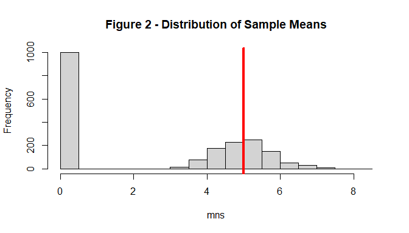
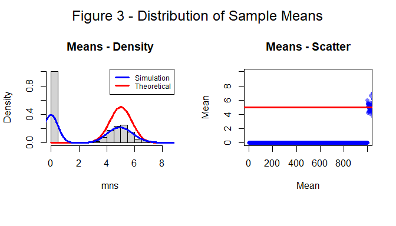
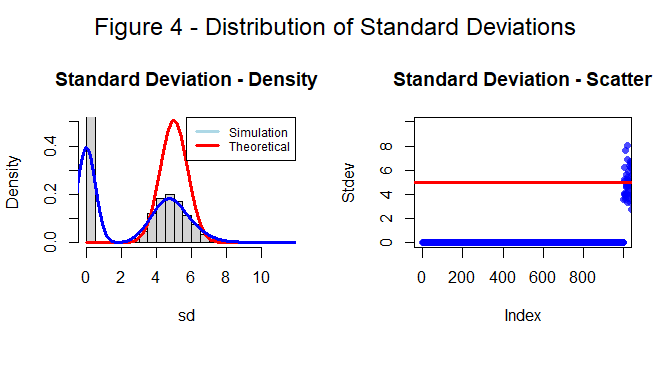
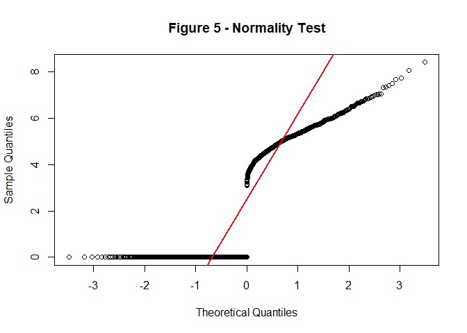

Simulating Exponential Distributions
================

## Synopsis

R is loaded with powerful methods for simulating, modeling and analyzing
data. In this document I give a basic simulation of exponential data and
compare that data with a theoretical model.

### Simulation

We start by simulating 1000 trials with 40 observations each. This is
accomplished using a for loop and the rexp() function. The means and
standard deviations for each trial are saved in respective data frames.

``` r
lambda <- 0.2
n <- 40
M<- 1000
mns = numeric(M)
sd = numeric(M)
dat = numeric()

for (i in 1:M) {
       set.seed(i)
       dat = c(dat, rexp(n, lambda))
       mns = c(mns, mean(rexp(n, lambda)))
       sd = c(sd, sd(rexp(n, lambda)))
}
```

#### Sample Mean vs Theoretical Mean

Using the data we can calculate the simulated and theoretical means.

``` r
sample_mean = mean(mns)
sample_mean
```

    ## [1] 2.505622

``` r
mu = 1/lambda
mu
```

    ## [1] 5

``` r
hist(mns, 22, main = "Figure 2 - Distribution of Sample Means")
abline(v=5,lw=4,col="red")
```

<!-- -->

The results show that the sample mean is off by only 0.011. In the
figure below we can further see that the distirbution of the means is
approximately normal.

<!-- -->

#### Sample Variance vs Theoretical Variance

Next we calculate the standard deviations and variances.

``` r
sample_var <- var(mns)
sample_var
```

    ## [1] 6.586032

``` r
sigma <- (1/lambda^2)/n
sigma
```

    ## [1] 0.625

The variances match up closely. Below is a chart comparing theoretical
standard deviation distribution versus the standard deviation of the
sample data.

<!-- -->

Finally, we can test the normality using a q-q plot.

<!-- -->

### Appendix - Plot Codes

#### Plot1

``` r
plot(dat, pch = 16, col = adjustcolor("purple", alpha=0.05), ylim = c(0,25), ylab = "Variable", main = "Figure 1")
```

#### Plot 2

``` r
sample_mean = mean(mns)
sample_mean

mu = 1/lambda
mu

hist(mns, 22, 
     main = "Figure 2 - Distribution of Sample Means")
abline(v=5,lw=4,col="red")
```

#### Plot 3

``` r
#FIGURE 3
par(mfrow=c(1,2))
#Generating histogram as a density function
hist(mns, 22, freq = FALSE)
#Fitting the theoretical line
xfit <- seq(min(mns), max(mns), length = 100)
yfit <- dnorm(xfit, mean = 1/lambda, sd = 1/lambda/sqrt(n))
lines(xfit, yfit, pch=22, lty = 1, lw = 3, col = "red")
#Fitting the line to the data
lines(density(mns), lw = 3, col = "blue")
#Adding a legend
legend('topright', c("Simulation", "Theoretical"), col=c("blue", "red"), lw=c(3,3), cex = .75)
#plotting the data on the mean for the 1000 simulations
plot(mns, main = "Mean", ylab = "Mean", xlim = c(0,s), ylim = c(0,10), xlab = "Mean", pch = 16, col = adjustcolor("blue", alpha=0.44))
abline(h=5, col = "red", lw =3)
```

#### Plot 4

``` r
par(mfrow=c(1,2), oma=c(2,0,2,0))
hist(sd, 22, freq = FALSE, ylim = c(0,0.5), 
     main = "Standard Deviation - Density")

#Fitting the theoretical line
xfit <- seq(min(sd), max(sd), length = 100)
yfit <- dnorm(xfit, mean = 1/lambda, sd = 1/lambda/sqrt(n))
lines(xfit, yfit, pch=22, lty = 1, lw = 3, col = "red")

#Fitting the line to the data
lines(density(sd), lw = 3, col = "blue")

#Adding a legend and title
legend('topright', c("Simulation", "Theoretical"), 
       col=c("lightblue", "red"), 
       lw=c(3,3), cex = 0.75)
mtext("Figure 4 - Distribution of Standard Deviations", 
      outer = TRUE, cex = 1.5)
plot(sd, main = "Standard Deviation - Scatter", 
     ylab = "Stdev", xlim = c(0,s), 
     ylim = c(0,10),pch = 16, 
     col = adjustcolor("blue", alpha=0.7))
abline(h=5, col = "red", lw =3)
```

``` r
qqnorm(mns, main= "Figure 5 - Normality Test")
qqline(mns, col="red", lw = "2")
```
